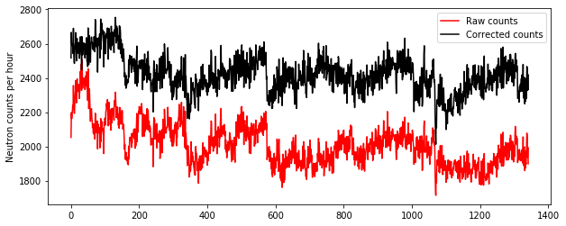
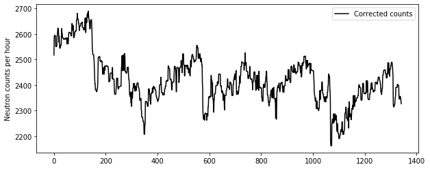
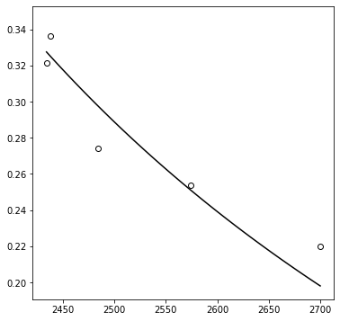

# Neutron Counts to Volumetric Water Content

A script to translate counts of epithermal neutrons into volumetric water content. The example was generated using data obtained from three Lihium-Foil neutron detectors and a MetSense device that measured atmospheric pressure, relative humidity, and air temperature. All measurements were recorded at hourly intervals


```python
# Import modules
import pandas as pd
import matplotlib.pyplot as plt
import numpy as np
from scipy import signal
from scipy.optimize import curve_fit

```


```python
# Load data
df = pd.read_csv('../datasets/stationary_cosmos_hydroinnova.csv')
df.head()

```


<div>
<style scoped>
    .dataframe tbody tr th:only-of-type {
        vertical-align: middle;
    }

    .dataframe tbody tr th {
        vertical-align: top;
    }

    .dataframe thead th {
        text-align: right;
    }
</style>
<table border="1" class="dataframe">
  <thead>
    <tr style="text-align: right;">
      <th></th>
      <th>RecordNum</th>
      <th>Date Time(UTC)</th>
      <th>P4_mb</th>
      <th>P1_mb</th>
      <th>T1_C</th>
      <th>RH1</th>
      <th>T_CS215</th>
      <th>RH_CS215</th>
      <th>Vbat</th>
      <th>N1Cts</th>
      <th>N1ET_sec</th>
      <th>N1T_C</th>
      <th>N1RH</th>
    </tr>
  </thead>
  <tbody>
    <tr>
      <th>0</th>
      <td>1</td>
      <td>2020/04/10 16:34:00</td>
      <td>984.21</td>
      <td>984.6</td>
      <td>10.9</td>
      <td>17.1</td>
      <td>7.7</td>
      <td>32.7</td>
      <td>14.453</td>
      <td>2053</td>
      <td>3494</td>
      <td>12.8</td>
      <td>0</td>
    </tr>
    <tr>
      <th>1</th>
      <td>2</td>
      <td>2020/04/10 17:34:00</td>
      <td>982.98</td>
      <td>983.3</td>
      <td>12.3</td>
      <td>14.7</td>
      <td>8.9</td>
      <td>29.0</td>
      <td>14.003</td>
      <td>2198</td>
      <td>3600</td>
      <td>14.8</td>
      <td>0</td>
    </tr>
    <tr>
      <th>2</th>
      <td>3</td>
      <td>2020/04/10 18:34:00</td>
      <td>981.50</td>
      <td>981.9</td>
      <td>13.5</td>
      <td>13.1</td>
      <td>10.8</td>
      <td>28.9</td>
      <td>13.995</td>
      <td>2162</td>
      <td>3600</td>
      <td>15.7</td>
      <td>0</td>
    </tr>
    <tr>
      <th>3</th>
      <td>4</td>
      <td>2020/04/10 19:34:00</td>
      <td>979.95</td>
      <td>980.5</td>
      <td>13.8</td>
      <td>12.1</td>
      <td>11.3</td>
      <td>28.1</td>
      <td>13.959</td>
      <td>2177</td>
      <td>3600</td>
      <td>16.0</td>
      <td>0</td>
    </tr>
    <tr>
      <th>4</th>
      <td>5</td>
      <td>2020/04/10 20:34:00</td>
      <td>978.16</td>
      <td>978.7</td>
      <td>15.5</td>
      <td>11.4</td>
      <td>13.5</td>
      <td>24.9</td>
      <td>13.906</td>
      <td>2212</td>
      <td>3600</td>
      <td>17.5</td>
      <td>0</td>
    </tr>
  </tbody>
</table>
</div>


```python
# Display range of dataset
print(df['Date Time(UTC)'].iloc[0])
print(df['Date Time(UTC)'].iloc[-1])

```

     2020/04/10 16:34:00
     2020/06/05 13:34:00


```python
# Re-define variables to match literature notation
P = df['P1_mb']
RH = df['RH_CS215']
T = df['T_CS215']
N_raw = df['N1Cts']

```

## Step 1: Correct neutron counts

Neutron counts need to be first corrected to eliminate the effect of incoming neutron flux, atmospheric pressure, and water vapor.


```python
# Atmospheric attenuation coefficient (mbar^-1) (see Dong et al. 2014 p.4)
beta = 0.0077

# Long-term average atmospheric pressure for current location in mbars
Pref = 960

# Pressure adjustment factor (fp) [Eq. 1] Hawdon et al. 2014
fp = np.exp(beta*(P - Pref))

# Atmospheric water vapor correction
# saturation vapor pressure in Pascals Eq. 3.8 p. 41 Environmental Biophysics
e_sat = 0.611*np.exp(17.502*T/(T + 240.97))*1000

# Vapor pressure Pascals
Pw = e_sat*RH/100

# 0 g m^-3 (dry air)
A_ref = 0

# Constant in g K/J
C = 2.16679

# Absolute humidity [g/m^3]
A = C*Pw/(T + 273.15)

# Water vapor adjustment factor
fwv = 1 + 0.0054*(A - A_ref)

# Assumes incoming neutron intensity correction fi = 1 
# Visit http://www01.nmdb.eu/nest/index.php to obtain neutron counts for a location
# with similar cutoff rigidity.
# Flutuations are often less than 5%, which means the adjustment factor oscillates around 1.
fi = 1

# Apply correction factors
N_corrected = np.round(N_raw*(fp*fwv/fi))

```


```python
# Plot raw and corrected neutrons
plt.figure(figsize=(10,4))
plt.plot(N_raw,'-r', label='Raw counts')
plt.plot(N_corrected, '-k', label='Corrected counts')
plt.ylabel('Neutron counts per hour')
plt.legend()
plt.show()

```





## Step 2: Smooth time series of corrected neutron counts

This step aims at emoveing some of the noise due to the random nature of neutron flux


```python
# Smooth corrected neutron counts
N_corrected = signal.medfilt(N_corrected, kernel_size=7)

```


```python
# Plot smoothed corrected neutrons
plt.figure(figsize=(10,4))
plt.plot(N_corrected, '-k', label='Corrected counts')
plt.ylabel('Neutron counts per hour')
plt.legend()
plt.show()

```





## Step 3: Field calibration


```python
# Values obtained from field sampling in the 0-15 cm layer in each cardinal direction
vwc_cal = [0.2537, 0.3212, 0.3363, 0.2740, 0.22] # Field average soil moisture. All samples have equal weight.
N_cal = [2574, 2434, 2438, 2484, 2700] # Average corrected counts of hour before, during, and after field sampling

```


```python
0.0154*0.556
```


    0.008562400000000001


```python
# Fit model

# Lattice water g/g
# Value from composite sample or average of multiple field samples
Wlat = 0.033

# Total organic carbon as water equivalent g/g
# ratio of 5 times the molecular weight of water to the molecular weight of cellulose. 
# The factor of 5 is based on 10 H atoms per molecule of cellulose but only 2 per water molecule
TOC = 0.015 #  total organic carbon
Wsom = TOC*0.556

# Bulk density
rho_b = 1.54 # Mg/m3
model = lambda x,N0: (0.0808 / (x/N0 - 0.372) - 0.115 - Wlat - Wsom)*rho_b
par_opt, par_cov = curve_fit(model, N_cal, vwc_cal)

# Counts per hour in scenario with no water (thought to be device specific)
N0 = round(par_opt[0])
print(N0)

```

    4119.0


```python
# Plot optimized model
xdata = np.linspace(np.min(N_cal), np.max(N_cal), 100)
ydata = model(xdata, *par_opt)

plt.figure(figsize=(6,6))
plt.scatter(N_cal, vwc_cal, color='k', marker='o', facecolor='w')
plt.plot(xdata, ydata, '-k')
plt.show()
```





## Step 3: Convert corrected neutron counts into volumetric water content


```python
# Convert neutron counts into volumetric water content (theta)
# Desilets et al 2010.
theta = (0.0808 / (N_corrected/N0 - 0.372) - 0.115 - Wlat - Wsom)*rho_b

```


```python
# Plot resulting volumetric water content
plt.figure(figsize=(10,4))
plt.plot(theta, '-k', label='theta')
plt.ylabel('Volumetric water content $(m^3/m^{-3})$')
plt.legend()
plt.show()

```


