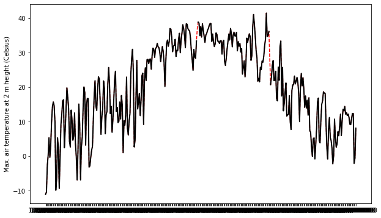
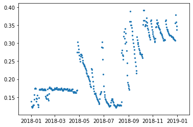

# Fill Missing Soil Moisture Timeseries

Once in a while we handle a dataset containing missing values. Interpolation can help us to fill in some of these gaps. Interpolation can also be used to estimate values between observations without the need for collecting or storing more data.

Using a daily dataset of weather data for the Kansas Mesonet located near Gypsum, KS we will fill few missing observation of air temperature and then we will create an hourly timeseries of volumetric water content from a daily timeseries using multiple one-dimensional interpolation methods.


```python
import pandas as pd
import numpy as np
import matplotlib.pyplot as plt

```


```python
df = pd.read_csv("../datasets/gypsum_ks_daily_2018.csv")
df.head()

```


<div>
<style scoped>
    .dataframe tbody tr th:only-of-type {
        vertical-align: middle;
    }

    .dataframe tbody tr th {
        vertical-align: top;
    }

    .dataframe thead th {
        text-align: right;
    }
</style>
<table border="1" class="dataframe">
  <thead>
    <tr style="text-align: right;">
      <th></th>
      <th>TIMESTAMP</th>
      <th>STATION</th>
      <th>PRESSUREAVG</th>
      <th>PRESSUREMAX</th>
      <th>PRESSUREMIN</th>
      <th>SLPAVG</th>
      <th>TEMP2MAVG</th>
      <th>TEMP2MMIN</th>
      <th>TEMP2MMAX</th>
      <th>TEMP10MAVG</th>
      <th>...</th>
      <th>SOILTMP10MAX</th>
      <th>SOILTMP10MIN</th>
      <th>SOILTMP5AVG655</th>
      <th>SOILTMP10AVG655</th>
      <th>SOILTMP20AVG655</th>
      <th>SOILTMP50AVG655</th>
      <th>VWC5CM</th>
      <th>VWC10CM</th>
      <th>VWC20CM</th>
      <th>VWC50CM</th>
    </tr>
  </thead>
  <tbody>
    <tr>
      <th>0</th>
      <td>1/1/18 0:00</td>
      <td>Gypsum</td>
      <td>99.44</td>
      <td>100.03</td>
      <td>98.73</td>
      <td>104.44</td>
      <td>-15.15</td>
      <td>-19.56</td>
      <td>-11.00</td>
      <td>-15.31</td>
      <td>...</td>
      <td>-1.18</td>
      <td>-2.45</td>
      <td>-1.33</td>
      <td>-1.14</td>
      <td>0.74</td>
      <td>3.50</td>
      <td>0.1377</td>
      <td>0.1167</td>
      <td>0.2665</td>
      <td>0.2203</td>
    </tr>
    <tr>
      <th>1</th>
      <td>1/2/18 0:00</td>
      <td>Gypsum</td>
      <td>99.79</td>
      <td>100.14</td>
      <td>99.40</td>
      <td>104.88</td>
      <td>-16.48</td>
      <td>-22.10</td>
      <td>-10.40</td>
      <td>-16.38</td>
      <td>...</td>
      <td>-1.56</td>
      <td>-3.46</td>
      <td>-2.10</td>
      <td>-1.82</td>
      <td>0.28</td>
      <td>3.13</td>
      <td>0.1234</td>
      <td>0.1021</td>
      <td>0.2642</td>
      <td>0.2196</td>
    </tr>
    <tr>
      <th>2</th>
      <td>1/3/18 0:00</td>
      <td>Gypsum</td>
      <td>98.87</td>
      <td>99.52</td>
      <td>97.94</td>
      <td>103.81</td>
      <td>-11.03</td>
      <td>-20.64</td>
      <td>-2.71</td>
      <td>-10.66</td>
      <td>...</td>
      <td>-1.49</td>
      <td>-3.61</td>
      <td>-2.21</td>
      <td>-1.93</td>
      <td>-0.08</td>
      <td>2.76</td>
      <td>0.1206</td>
      <td>0.0965</td>
      <td>0.2353</td>
      <td>0.2189</td>
    </tr>
    <tr>
      <th>3</th>
      <td>1/4/18 0:00</td>
      <td>Gypsum</td>
      <td>98.22</td>
      <td>98.54</td>
      <td>97.90</td>
      <td>102.99</td>
      <td>-5.83</td>
      <td>-11.79</td>
      <td>0.24</td>
      <td>-5.01</td>
      <td>...</td>
      <td>-0.98</td>
      <td>-2.67</td>
      <td>-1.60</td>
      <td>-1.46</td>
      <td>-0.21</td>
      <td>2.45</td>
      <td>0.1235</td>
      <td>0.0973</td>
      <td>0.2094</td>
      <td>0.2182</td>
    </tr>
    <tr>
      <th>4</th>
      <td>1/5/18 0:00</td>
      <td>Gypsum</td>
      <td>98.10</td>
      <td>98.42</td>
      <td>97.75</td>
      <td>102.88</td>
      <td>-4.73</td>
      <td>-14.22</td>
      <td>5.36</td>
      <td>-4.23</td>
      <td>...</td>
      <td>-0.72</td>
      <td>-2.81</td>
      <td>-1.54</td>
      <td>-1.38</td>
      <td>-0.25</td>
      <td>2.25</td>
      <td>0.1249</td>
      <td>0.0976</td>
      <td>0.2047</td>
      <td>0.2180</td>
    </tr>
  </tbody>
</table>
<p>5 rows × 44 columns</p>
</div>


```python
df.isna().sum()
```


    TIMESTAMP          0
    STATION            0
    PRESSUREAVG        0
    PRESSUREMAX        0
    PRESSUREMIN        0
    SLPAVG             0
    TEMP2MAVG          1
    TEMP2MMIN          1
    TEMP2MMAX          2
    TEMP10MAVG         0
    TEMP10MMIN         1
    TEMP10MMAX         2
    RELHUM2MAVG        0
    RELHUM2MMAX        0
    RELHUM2MMIN        1
    RELHUM10MAVG       0
    RELHUM10MMAX       0
    RELHUM10MMIN       1
    VPDEFAVG           1
    PRECIP             0
    SRAVG              0
    SR                 0
    WSPD2MAVG          0
    WSPD2MMAX          0
    WSPD10MAVG         0
    WSPD10MMAX         0
    WDIR2M             0
    WDIR2MSTD          0
    WDIR10M            0
    WDIR10MSTD         0
    SOILTMP5AVG        0
    SOILTMP5MAX        0
    SOILTMP5MIN        0
    SOILTMP10AVG       0
    SOILTMP10MAX       0
    SOILTMP10MIN       0
    SOILTMP5AVG655     0
    SOILTMP10AVG655    0
    SOILTMP20AVG655    0
    SOILTMP50AVG655    0
    VWC5CM             0
    VWC10CM            0
    VWC20CM            0
    VWC50CM            0
    dtype: int64


```python
# Get position of missing max air temperature at 2-m height
idx = df["TEMP2MMAX"].isna()
df.loc[idx,"TEMP2MMAX"]

```


    178   NaN
    263   NaN
    Name: TEMP2MMAX, dtype: float64


```python
# Interpolate missing data
plt.figure(figsize=(10,6))
plt.plot(df["TIMESTAMP"], df["TEMP2MMAX"].interpolate(method='polynomial', order=2), '--r')
plt.plot(df["TIMESTAMP"], df["TEMP2MMAX"], '-k', linewidth=2)
plt.ylabel('Max. air temperature at 2 m height (Celsius)')
plt.show()

```





## Daily to hourly data


```python
# Convert date strings to pandas datetime format
df["TIMESTAMP"] = pd.to_datetime(df["TIMESTAMP"], format="%m/%d/%y %H:%M")

```


```python
# Inspect data
plt.plot(df["TIMESTAMP"], df["VWC5CM"])
plt.show()

```


When we use the `plot` command the library automatically connects consecutive points. In reality, individual observations should be represented using a scatter plot.


```python
plt.scatter(df["TIMESTAMP"], df["VWC5CM"], s=5)
plt.show()
```





For most applications daily time steps are adequate and either plot will suffice our objectives. But what if we need to estimate the sub-daily soil moisture based on daily values. Can we fill these gaps by interpolating the data? Can we use the same technique to fill in the gaps left by missing observations?


```python
df_hourly = pd.DataFrame()
df_hourly["TIMESTAMP"] = pd.date_range(start=df["TIMESTAMP"].iloc[0], end=df["TIMESTAMP"].iloc[-1], freq='H')
df_hourly.head()

```


<div>
<style scoped>
    .dataframe tbody tr th:only-of-type {
        vertical-align: middle;
    }

    .dataframe tbody tr th {
        vertical-align: top;
    }

    .dataframe thead th {
        text-align: right;
    }
</style>
<table border="1" class="dataframe">
  <thead>
    <tr style="text-align: right;">
      <th></th>
      <th>TIMESTAMP</th>
    </tr>
  </thead>
  <tbody>
    <tr>
      <th>0</th>
      <td>2018-01-01 00:00:00</td>
    </tr>
    <tr>
      <th>1</th>
      <td>2018-01-01 01:00:00</td>
    </tr>
    <tr>
      <th>2</th>
      <td>2018-01-01 02:00:00</td>
    </tr>
    <tr>
      <th>3</th>
      <td>2018-01-01 03:00:00</td>
    </tr>
    <tr>
      <th>4</th>
      <td>2018-01-01 04:00:00</td>
    </tr>
  </tbody>
</table>
</div>


```python
print("Daily dataframe: ", df["TIMESTAMP"].iloc[0])
print("Daily dataframe: ", df["TIMESTAMP"].iloc[-1])

print("Hourly dataframe: ", df_hourly["TIMESTAMP"].iloc[0])
print("Hourly dataframe: ", df_hourly["TIMESTAMP"].iloc[-1])
```

    Daily dataframe:  2018-01-01 00:00:00
    Daily dataframe:  2018-12-31 00:00:00
    Hourly dataframe:  2018-01-01 00:00:00
    Hourly dataframe:  2018-12-31 00:00:00


```python
idx_timestamp = df_hourly["TIMESTAMP"].isin(df["TIMESTAMP"])
print(idx_timestamp.shape)
idx_timestamp

```

    (8737,)


    0        True
    1       False
    2       False
    3       False
    4       False
            ...  
    8732    False
    8733    False
    8734    False
    8735    False
    8736     True
    Name: TIMESTAMP, Length: 8737, dtype: bool


```python
df_hourly["VWC5CM"] = np.nan
df_hourly.head()

```


<div>
<style scoped>
    .dataframe tbody tr th:only-of-type {
        vertical-align: middle;
    }

    .dataframe tbody tr th {
        vertical-align: top;
    }

    .dataframe thead th {
        text-align: right;
    }
</style>
<table border="1" class="dataframe">
  <thead>
    <tr style="text-align: right;">
      <th></th>
      <th>TIMESTAMP</th>
      <th>VWC5CM</th>
    </tr>
  </thead>
  <tbody>
    <tr>
      <th>0</th>
      <td>2018-01-01 00:00:00</td>
      <td>NaN</td>
    </tr>
    <tr>
      <th>1</th>
      <td>2018-01-01 01:00:00</td>
      <td>NaN</td>
    </tr>
    <tr>
      <th>2</th>
      <td>2018-01-01 02:00:00</td>
      <td>NaN</td>
    </tr>
    <tr>
      <th>3</th>
      <td>2018-01-01 03:00:00</td>
      <td>NaN</td>
    </tr>
    <tr>
      <th>4</th>
      <td>2018-01-01 04:00:00</td>
      <td>NaN</td>
    </tr>
  </tbody>
</table>
</div>


```python
#df_hourly.loc[idx_timestamp,"VWC5CM"] = df["VWC5CM"]

#df_hourly = df_hourly.merge(df, how='left', left_on='TIMESTAMP', right_on='TIMESTAMP')
#df_hourly.head(50)

for i in range(df.shape[0]):
    for j in range(df_hourly.shape[0]):
        if df["TIMESTAMP"][i] == df_hourly["TIMESTAMP"][j]:
            df_hourly["VWC5CM"].iloc[j] = df["VWC5CM"].iloc[i]
            
```

    /opt/anaconda3/lib/python3.7/site-packages/pandas/core/indexing.py:670: SettingWithCopyWarning: 
    A value is trying to be set on a copy of a slice from a DataFrame
    
    See the caveats in the documentation: https://pandas.pydata.org/pandas-docs/stable/user_guide/indexing.html#returning-a-view-versus-a-copy
      self._setitem_with_indexer(indexer, value)


```python
df_hourly["VWC5CM_linear"] = df_hourly["VWC5CM"].interpolate(method='linear')
df_hourly["VWC5CM_poly2"] = df_hourly["VWC5CM"].interpolate(method='polynomial', order=2)
df_hourly["VWC5CM_pchip"] = df_hourly["VWC5CM"].interpolate(method='pchip')
df_hourly

```


<div>
<style scoped>
    .dataframe tbody tr th:only-of-type {
        vertical-align: middle;
    }

    .dataframe tbody tr th {
        vertical-align: top;
    }

    .dataframe thead th {
        text-align: right;
    }
</style>
<table border="1" class="dataframe">
  <thead>
    <tr style="text-align: right;">
      <th></th>
      <th>TIMESTAMP</th>
      <th>VWC5CM</th>
      <th>VWC5CM_linear</th>
      <th>VWC5CM_poly2</th>
      <th>VWC5CM_pchip</th>
    </tr>
  </thead>
  <tbody>
    <tr>
      <th>0</th>
      <td>2018-01-01 00:00:00</td>
      <td>0.1377</td>
      <td>0.137700</td>
      <td>0.137700</td>
      <td>0.137700</td>
    </tr>
    <tr>
      <th>1</th>
      <td>2018-01-01 01:00:00</td>
      <td>NaN</td>
      <td>0.137104</td>
      <td>0.136859</td>
      <td>0.136868</td>
    </tr>
    <tr>
      <th>2</th>
      <td>2018-01-01 02:00:00</td>
      <td>NaN</td>
      <td>0.136508</td>
      <td>0.136040</td>
      <td>0.136044</td>
    </tr>
    <tr>
      <th>3</th>
      <td>2018-01-01 03:00:00</td>
      <td>NaN</td>
      <td>0.135912</td>
      <td>0.135242</td>
      <td>0.135231</td>
    </tr>
    <tr>
      <th>4</th>
      <td>2018-01-01 04:00:00</td>
      <td>NaN</td>
      <td>0.135317</td>
      <td>0.134465</td>
      <td>0.134429</td>
    </tr>
    <tr>
      <th>...</th>
      <td>...</td>
      <td>...</td>
      <td>...</td>
      <td>...</td>
      <td>...</td>
    </tr>
    <tr>
      <th>8732</th>
      <td>2018-12-30 20:00:00</td>
      <td>NaN</td>
      <td>0.339033</td>
      <td>0.339185</td>
      <td>0.338985</td>
    </tr>
    <tr>
      <th>8733</th>
      <td>2018-12-30 21:00:00</td>
      <td>NaN</td>
      <td>0.338600</td>
      <td>0.338720</td>
      <td>0.338562</td>
    </tr>
    <tr>
      <th>8734</th>
      <td>2018-12-30 22:00:00</td>
      <td>NaN</td>
      <td>0.338167</td>
      <td>0.338250</td>
      <td>0.338140</td>
    </tr>
    <tr>
      <th>8735</th>
      <td>2018-12-30 23:00:00</td>
      <td>NaN</td>
      <td>0.337733</td>
      <td>0.337777</td>
      <td>0.337719</td>
    </tr>
    <tr>
      <th>8736</th>
      <td>2018-12-31 00:00:00</td>
      <td>0.3373</td>
      <td>0.337300</td>
      <td>0.337300</td>
      <td>0.337300</td>
    </tr>
  </tbody>
</table>
<p>8737 rows × 5 columns</p>
</div>


```python
plt.figure(figsize=(12,6))
plt.scatter(df["TIMESTAMP"],df["VWC5CM"], marker='s', s=50, facecolor='k')
plt.plot(df_hourly["TIMESTAMP"], df_hourly["VWC5CM_linear"], '--b', alpha=1, linewidth=2)
plt.plot(df_hourly["TIMESTAMP"], df_hourly["VWC5CM_poly2"], ':g', alpha=1, linewidth=3)
plt.plot(df_hourly["TIMESTAMP"], df_hourly["VWC5CM_pchip"], '-k', alpha=1, linewidth=2)
#plt.scatter(df_hourly["TIMESTAMP"], df_hourly["VWC5CM_linear"], marker='+', s=40, alpha=1)

plt.xlim(df_hourly["TIMESTAMP"].iloc[4150], df_hourly["TIMESTAMP"].iloc[4300])
plt.xticks(rotation=45)
plt.show()

```


