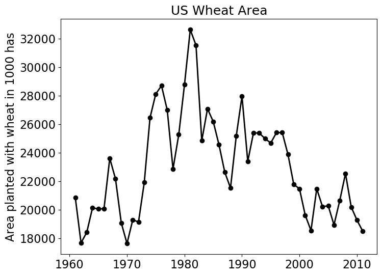
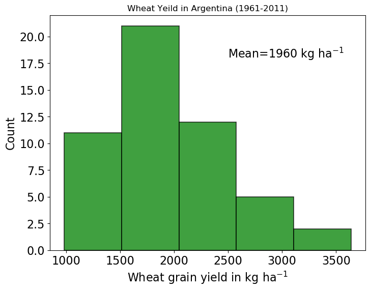
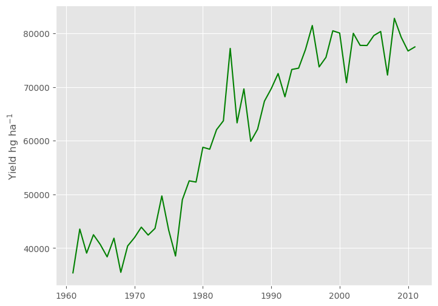

# Basic Plots with Matplotlib


[Matplotlib](https://matplotlib.org/users/index.html) is one of the most popular plotting libraries in Python. The [pyplot](https://matplotlib.org/api/_as_gen/matplotlib.pyplot.html) sub-module is a high-level library of plotting commands very similar to Matlab syntax. Overt the years the community of Python users have developed a substantial amount of plots and an extensive documentation for Matplotlib. While more interactive libraries such as Bokeh and Plotly are strongly emerging in the plotting world, Matplotlib is still the most popular in the scientific enviroment and one of the easiest to get started.

It is common to tuse Matplotlib in combination with Numpy and Pandas modules. So, in this example we will use all three of them to generate some basic plots.


```python
# Line required when plotting in Jupyter Lab
import matplotlib.pyplot as plt
import pandas as pd
import numpy as np

```

<a name="matplotlib_parameters"></a>
## Parameters

Before we create a plot I want to show how to access all the parameters in a plot, so that can search and learn about all the possibilities.


```python
print(plt.rcParams.items) # List is long

#plt.rcParams['axes.grid'] = False;
#plt.rcParams['ytick.labelsize'] = 14.0
#plt.rcParams['xtick.labelsize'] = 14.0
#plt.rcParams['axes.facecolor'] = 'w'
#plt.rcParams['axes.spines.top'] = True
```


```python
# Load wheat data
df = pd.read_csv('../datasets/global_wheat.csv')
df.head(5)

```


<div>
<style scoped>
    .dataframe tbody tr th:only-of-type {
        vertical-align: middle;
    }

    .dataframe tbody tr th {
        vertical-align: top;
    }

    .dataframe thead th {
        text-align: right;
    }
</style>
<table border="1" class="dataframe">
  <thead>
    <tr style="text-align: right;">
      <th></th>
      <th>year</th>
      <th>Argentina_area_has</th>
      <th>Argentina_production_ton</th>
      <th>Argentina_yield_hg_ha</th>
      <th>Australia_area_has</th>
      <th>Australia_production_ton</th>
      <th>Australia_yield_hg_ha</th>
      <th>Canada_area_has</th>
      <th>Canada_production_ton</th>
      <th>Canada_yield_hg_ha</th>
      <th>...</th>
      <th>Germany_yield_hg_ha</th>
      <th>Mexico_area_has</th>
      <th>Mexico_production_ton</th>
      <th>Mexico_yield_hg_ha</th>
      <th>UK_area_has</th>
      <th>UK_production_ton</th>
      <th>UK_yield_hg_ha</th>
      <th>US_area_has</th>
      <th>US_production_ton</th>
      <th>US_yield_hg_ha</th>
    </tr>
  </thead>
  <tbody>
    <tr>
      <th>0</th>
      <td>1961</td>
      <td>4420900</td>
      <td>5725000</td>
      <td>12950</td>
      <td>5958110</td>
      <td>6727190</td>
      <td>11291</td>
      <td>10245000</td>
      <td>7713000</td>
      <td>7529</td>
      <td>...</td>
      <td>28607</td>
      <td>836538</td>
      <td>1401910</td>
      <td>16758</td>
      <td>739000</td>
      <td>2614000</td>
      <td>35372</td>
      <td>20870000</td>
      <td>33539000</td>
      <td>16070</td>
    </tr>
    <tr>
      <th>1</th>
      <td>1962</td>
      <td>3744700</td>
      <td>5700000</td>
      <td>15222</td>
      <td>6664680</td>
      <td>8352910</td>
      <td>12533</td>
      <td>10853000</td>
      <td>15393000</td>
      <td>14183</td>
      <td>...</td>
      <td>33898</td>
      <td>747728</td>
      <td>1455260</td>
      <td>19462</td>
      <td>913000</td>
      <td>3974000</td>
      <td>43527</td>
      <td>17680000</td>
      <td>29718000</td>
      <td>16809</td>
    </tr>
    <tr>
      <th>2</th>
      <td>1963</td>
      <td>5676000</td>
      <td>8940000</td>
      <td>15751</td>
      <td>6666680</td>
      <td>8924460</td>
      <td>13387</td>
      <td>11156000</td>
      <td>19691000</td>
      <td>17651</td>
      <td>...</td>
      <td>33934</td>
      <td>819210</td>
      <td>1702990</td>
      <td>20788</td>
      <td>780000</td>
      <td>3046000</td>
      <td>39051</td>
      <td>18415000</td>
      <td>31211900</td>
      <td>16949</td>
    </tr>
    <tr>
      <th>3</th>
      <td>1964</td>
      <td>6135400</td>
      <td>11260000</td>
      <td>18353</td>
      <td>7251500</td>
      <td>10037000</td>
      <td>13841</td>
      <td>12018000</td>
      <td>16349000</td>
      <td>13604</td>
      <td>...</td>
      <td>34845</td>
      <td>818325</td>
      <td>2203070</td>
      <td>26922</td>
      <td>893000</td>
      <td>3793000</td>
      <td>42475</td>
      <td>20138000</td>
      <td>34928000</td>
      <td>17344</td>
    </tr>
    <tr>
      <th>4</th>
      <td>1965</td>
      <td>4601200</td>
      <td>6079000</td>
      <td>13212</td>
      <td>7087980</td>
      <td>7067060</td>
      <td>9970</td>
      <td>11453000</td>
      <td>17674000</td>
      <td>15432</td>
      <td>...</td>
      <td>32321</td>
      <td>858259</td>
      <td>2150350</td>
      <td>25055</td>
      <td>1026000</td>
      <td>4171000</td>
      <td>40653</td>
      <td>20056000</td>
      <td>35805000</td>
      <td>17853</td>
    </tr>
  </tbody>
</table>
<p>5 rows × 28 columns</p>
</div>


```python
df.tail(5)
```


<div>
<style scoped>
    .dataframe tbody tr th:only-of-type {
        vertical-align: middle;
    }

    .dataframe tbody tr th {
        vertical-align: top;
    }

    .dataframe thead th {
        text-align: right;
    }
</style>
<table border="1" class="dataframe">
  <thead>
    <tr style="text-align: right;">
      <th></th>
      <th>year</th>
      <th>Argentina_area_has</th>
      <th>Argentina_production_ton</th>
      <th>Argentina_yield_hg_ha</th>
      <th>Australia_area_has</th>
      <th>Australia_production_ton</th>
      <th>Australia_yield_hg_ha</th>
      <th>Canada_area_has</th>
      <th>Canada_production_ton</th>
      <th>Canada_yield_hg_ha</th>
      <th>...</th>
      <th>Germany_yield_hg_ha</th>
      <th>Mexico_area_has</th>
      <th>Mexico_production_ton</th>
      <th>Mexico_yield_hg_ha</th>
      <th>UK_area_has</th>
      <th>UK_production_ton</th>
      <th>UK_yield_hg_ha</th>
      <th>US_area_has</th>
      <th>US_production_ton</th>
      <th>US_yield_hg_ha</th>
    </tr>
  </thead>
  <tbody>
    <tr>
      <th>46</th>
      <td>2007</td>
      <td>5831680</td>
      <td>16486500</td>
      <td>28271</td>
      <td>12578300</td>
      <td>13569400</td>
      <td>10788</td>
      <td>8636300</td>
      <td>20054000</td>
      <td>23221</td>
      <td>...</td>
      <td>69611</td>
      <td>691679</td>
      <td>3515390</td>
      <td>50824</td>
      <td>1830000</td>
      <td>13221000</td>
      <td>72246</td>
      <td>20638800</td>
      <td>55820400</td>
      <td>27046</td>
    </tr>
    <tr>
      <th>47</th>
      <td>2008</td>
      <td>4334780</td>
      <td>8508160</td>
      <td>19628</td>
      <td>13530200</td>
      <td>21420200</td>
      <td>15831</td>
      <td>10031700</td>
      <td>28611100</td>
      <td>28521</td>
      <td>...</td>
      <td>80873</td>
      <td>801735</td>
      <td>4019400</td>
      <td>50134</td>
      <td>2080210</td>
      <td>17227000</td>
      <td>82814</td>
      <td>22540800</td>
      <td>68016100</td>
      <td>30175</td>
    </tr>
    <tr>
      <th>48</th>
      <td>2009</td>
      <td>3325460</td>
      <td>9016370</td>
      <td>27113</td>
      <td>13788000</td>
      <td>21656000</td>
      <td>15706</td>
      <td>9638200</td>
      <td>26847600</td>
      <td>27855</td>
      <td>...</td>
      <td>78091</td>
      <td>828408</td>
      <td>4116160</td>
      <td>49688</td>
      <td>1775000</td>
      <td>14076000</td>
      <td>79301</td>
      <td>20191200</td>
      <td>60365700</td>
      <td>29897</td>
    </tr>
    <tr>
      <th>49</th>
      <td>2010</td>
      <td>4373440</td>
      <td>15875700</td>
      <td>36300</td>
      <td>13507000</td>
      <td>22138000</td>
      <td>16390</td>
      <td>8268700</td>
      <td>23166800</td>
      <td>28017</td>
      <td>...</td>
      <td>73102</td>
      <td>678550</td>
      <td>3676710</td>
      <td>54185</td>
      <td>1939000</td>
      <td>14878000</td>
      <td>76730</td>
      <td>19270900</td>
      <td>60062400</td>
      <td>31167</td>
    </tr>
    <tr>
      <th>50</th>
      <td>2011</td>
      <td>4494280</td>
      <td>16354100</td>
      <td>36389</td>
      <td>13501800</td>
      <td>27410100</td>
      <td>20301</td>
      <td>8543600</td>
      <td>25261400</td>
      <td>29568</td>
      <td>...</td>
      <td>70193</td>
      <td>662221</td>
      <td>3627510</td>
      <td>54778</td>
      <td>1969000</td>
      <td>15257000</td>
      <td>77486</td>
      <td>18496400</td>
      <td>54413300</td>
      <td>29418</td>
    </tr>
  </tbody>
</table>
<p>5 rows × 28 columns</p>
</div>


## Line plots

Line plots are perhaps the most basic and widely used plots. Line plots are often used to represent timeseries, regression lines, and modeling outcomes, particularly for observations or simulations collected at high frequency.

Other possible colors are: 

`k`: black,
`b`: blue,
`g`: green,
`y`: yellow

Other possible line styles are:
`--`: Dashed line,
`-.`: Dashed dot line,
`:`:  Dotted line


```python
plt.figure(figsize=(8,6))

plt.plot(df["year"], df["US_area_has"]/1000, '-ok', linewidth=2)
plt.title('US Wheat Area', size=18, fontweight='normal')
plt.xticks(fontsize=16)
plt.ylabel("Area planted with wheat in 1000 has", size=16)
plt.yticks(fontsize=16)

plt.show()

```





## Scatter plots

Scatter plots are versatile and are typically used to represent sparse timeseries, sporadic events on top of a more detailed timeseries, or to describe correlation (although not necessarily causality).


```python
plt.figure(figsize=(8,6))

plt.scatter(df["US_yield_hg_ha"]/10, df["US_production_ton"], 
            marker='o', 
            facecolor='b', 
            edgecolor='k',
            alpha=0.5)
plt.title('US Wheat Yield vs Production', size=18, fontweight='normal')
plt.xlabel("Wheat grain yield in kg ha$^{-1}$", size=16)
plt.xticks(fontsize=16)
plt.ylabel("Wheat production in metric tons", size=16)
plt.yticks(fontsize=16)
plt.grid(True)

plt.show()
```


## Histograms

Histograms are useful to identify the distribution of observations, central tendency, and extreme values.


```python
avg_yield = (df["Argentina_yield_hg_ha"]/10).mean()
median_yield = (df["Argentina_yield_hg_ha"]/10).median()

plt.figure(figsize=(8,6))

plt.hist(df["Argentina_yield_hg_ha"]/10, 
         bins=5, 
         density=False, 
         facecolor='g', 
         alpha=0.75,
         edgecolor='black', 
         linewidth=1.2)

plt.xlabel('Wheat grain yield in kg ha$^{-1}$', size=16)
plt.ylabel('Count', size=16)
plt.xticks(fontsize=16)
plt.yticks(fontsize=16)
plt.title('Wheat Yeild in Argentina (1961-2011)')
plt.text(2500, 18, 'Mean=' + str(round(avg_yield)) + ' kg ha$^{-1}$', size=16)
plt.ylim(0, 22)


plt.show()
```





## Subplots

The subplot() command specifies numrows, numcols, plot_number


```python
plt.figure(figsize=(10,6))

plt.subplot(2,2,1)
plt.title('Argentina', size=16)
plt.plot(df["year"], df["Argentina_yield_hg_ha"])
plt.ylabel('Yield hg ha$^{-1}$', size=16)
plt.ylim(0,100000)
plt.xticks(fontsize=16)
plt.yticks(fontsize=16)
plt.tight_layout()

plt.subplot(2,2,2)
plt.title('UK', size=16)
plt.plot(df["year"],df["UK_yield_hg_ha"])
plt.ylabel('Yield hg ha$^{-1}$', size=16)
plt.ylim(0,100000)
plt.xticks(fontsize=16)
plt.yticks(fontsize=16)
plt.tight_layout()

plt.subplot(2,2,3)
plt.title('Australia', size=16)
plt.plot(df["year"],df["Australia_yield_hg_ha"])
plt.ylabel('Yield hg ha$^{-1}$', size=16)
plt.ylim(0,100000)
plt.xticks(fontsize=16)
plt.yticks(fontsize=16)
plt.tight_layout()

plt.subplot(2,2,4)
plt.title('US', size=16)
plt.plot(df["year"],df["US_yield_hg_ha"])
plt.ylabel('Yield hg ha$^{-1}$', size=16)
plt.ylim(0,100000)
plt.xticks(fontsize=16)
plt.yticks(fontsize=16)
plt.tight_layout()

plt.show()

```


## Secondary Y axis plots


```python
# Creating plot with secondary Y axis
plt.figure(figsize=(12,8), facecolor='w')

plt.subplot()
plt.plot(df["year"],df["US_yield_hg_ha"],'-g')
plt.xlabel('Years', size=16)
plt.xticks(fontsize=16)
plt.ylabel('Yield hg ha$^{-1}$', color='g', size=16)
plt.yticks(fontsize=16)

plt.twinx()
plt.plot(df["year"],df["US_area_has"],'--b')
plt.yticks(fontsize=16)
plt.ylabel('Cultivated area (1000 has)', color='b', size=16)

plt.show()

```


<a name="matplotlib_styles"></a>
## Styles

In addition to the default style, Matplotlib has a variery of pre-defined styles. TO see some examples visit the following websites:

Gallery 1 at: https://matplotlib.org/gallery/style_sheets/style_sheets_reference.html

Gallery 2 at: https://tonysyu.github.io/raw_content/matplotlib-style-gallery/gallery.html

To see the available styles just type:


```python
print(plt.style.available)
```

    ['_classic_test', 'bmh', 'classic', 'dark_background', 'fast', 'fivethirtyeight', 'ggplot', 'grayscale', 'seaborn-bright', 'seaborn-colorblind', 'seaborn-dark-palette', 'seaborn-dark', 'seaborn-darkgrid', 'seaborn-deep', 'seaborn-muted', 'seaborn-notebook', 'seaborn-paper', 'seaborn-pastel', 'seaborn-poster', 'seaborn-talk', 'seaborn-ticks', 'seaborn-white', 'seaborn-whitegrid', 'seaborn', 'Solarize_Light2', 'tableau-colorblind10']


```python
# Change plot defaults to ggplot style (similar to ggplot R language library)
# Use plt.style.use('default') to revert.
plt.figure(figsize=(8,6))
plt.style.use('ggplot') # Use plt.style.use('default') to revert.
plt.plot(df["year"],df["UK_yield_hg_ha"],'-g')
plt.ylabel("Yield hg ha$^{-1}$")
plt.show()
```





## Saving a figure

```python
savefig(filename, dpi=None, facecolor='w', edgecolor='w',
        orientation='portrait', papertype=None, format=None,
        transparent=False, bbox_inches=None, pad_inches=0.1,
        frameon=None, metadata=None)
      
```
Source: https://matplotlib.org/api/_as_gen/matplotlib.pyplot.savefig.html


```python
# Example plot
plt.plot(df.year,df.Argentina_yield_hg_ha,'-g')

# Save command specifying the filename, image format, and number of dots per square inch (DPI)
plt.savefig('examplefig.png', dpi=200) 

plt.show()
```
