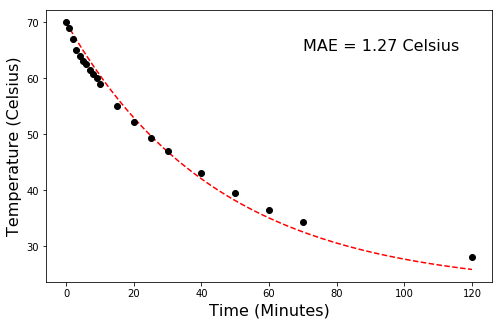

# Newton's law of cooling

The model states that the rate of cooling of a warm body without internal heating is proportional to the temperature difference between the body of interest and the ambient temperature. As a result, the temperature of the body with respect to its surroundings decreases exponentially with time.

$$\frac{dT}{dt}=-K(T_{obj} - T_{amb}) $$


$\frac{dT}{dt}$ Rate of change of temperature

$-K$ Newton's cooling constant of proportionality (found empirically)

$T_{obj}$ Temperature of the medium of interest

$T_{amb}$ Ambient temperature. Assumed to be constant and not affected by the object's temperature

The equation can be solved analytically or numerically. To practice `for loops` we will implement the solution numerically by discretizing the equation into one minute intervals. This means that the rate of cooling at time $t$ will be approximated by using the tmeperature of the object at time $t-1$. Numerical solutions are just approximations, but if we carefully select the time step and the way in which we conduct the iteration process, then the results can be extremely accurate. In more formal terms:

$$\frac{\Delta T}{\Delta t} \approx \frac{dT}{dt}=-K(T_{obj} - T_{amb}) $$


>Note that this law does not apply to homeotherm (opposite to poikilotherm) animals. For that case you may want to consider using Fourier's law of heat flow. For more details refer to Kleiber 1972. Some considerations for using this equation for homeotherms is given by Tracy 1972, in which a time-dependent constant of proportionality is suggested as a function of the changing environmental conditions (e.g. wind speed).

In case you are interested, a large portion of Neton's research notes have digitized by [Cambridge University Library](https://cudl.lib.cam.ac.uk/collections/newton/1). I highly encourage you to take a look at such wonderful collection from one of the greatest scientists of all time.


```python
# Define initial conditions of the system
dt = 1 # minutes
period = 121 # minutes
t_cup_pred = range(period)# minutes
T_cup_pred = [70] # Celsius
T_amb = 22.5 # Celsius
K = 0.022 # 1/minutes

```


```python
# Implement iterative solution
for t in range(1,period):
    dT = -K*(T_cup_pred[t-1] - T_amb)*dt # Change in temperature of object
    T_cup_pred_update = T_cup_pred[t-1] + dT # New temperature for current time step
    T_cup_pred.append(T_cup_pred_update)

```


```python
# Alternative one-line solution using the [-1] indexing operator
T_cup_pred = [70]
for t in range(1,period):
    T_cup_pred.append(T_cup_pred[-1] + -K*(T_cup_pred[-1] - T_amb)*dt)
    
```


```python
# Observations using hot water in a regular ceramic mug
T_cup_obs = [70,69,67,65,64,63,62.5,61.5,60.7,60,59,55,52.1,49.3,47,43,39.5,36.5,34.3,28]
t_cup_obs = [0,1,2,3,4,5,6,7,8,9,10,15,20,25,30,40,50,60,70,120]

```


```python
# A way to compute the mean absolute error (MAE) of the model
import numpy as np
E = np.take(T_cup_pred,t_cup_obs) - T_cup_obs # Compute error
MAE = np.mean(np.abs(E)) # Compute mean absolute error in Celsius
print(round(MAE,2), 'degrees Celsius')

```

    1.27 degrees Celsius


```python
import matplotlib.pyplot as plt
%matplotlib inline

plt.figure(figsize=(8,5))
plt.plot(t_cup_pred, T_cup_pred, '--r')
plt.plot(t_cup_obs, T_cup_obs, 'ok')  
plt.xlabel('Time (Minutes)', size=16)
plt.ylabel('Temperature (Celsius)', size=16)
plt.annotate('MAE = ' + str(round(MAE,2)) + ' Celsius', (70,65), size=16 )
#plt.savefig('myplot.jpg') # Save figure before rendering to avoid blank image
plt.show()

```





## References

Kleiber, M., 1972. A new Newton's law of cooling?. Science, 178(4067), pp.1283-1285.

Newton, I., 1701. Scala graduum caloris et frigoris. In Phil. Trans. R. Soc.

Tracy, C.R., 1972. Newton's law: its application for expressing heat losses from homeotherms. BioScience, 22(11), pp.656-659.

Vollmer, M., 2009. Newton's law of cooling revisited. European Journal of Physics, 30(5), p.1063.
