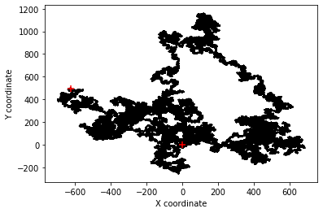
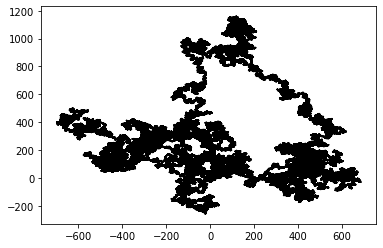

# Particle Random Walk

A random walk is an important concept in physics and chemistry that describes [Brownian motion](https://en.wikipedia.org/wiki/Brownian_motion). In this challenge you are required to simulate and track the path of a single particle, ignoring collisions with the boundaries (although this could be a nice addition).


The goal is to write a Python script that simulates the random movement of a particle (e.g. a colloid in aqueous suspension). This is often called a random walk since for each time step the particle will randomly "walk" from its current location to a new location. In this challenge you will need to create a figure to visualize the path of the particle.


```python
# Import modules
import numpy as np
import matplotlib.pyplot as plt

```


```python
# Set seed for reproducible results (optional)
np.random.seed(10)

# Initial particle position
current_xpos = 0
current_ypos = 0

# Initial list of positions
x = [current_xpos]
y = [current_ypos]

# Define number of particle steps
N = 1000000

# Generate set of random steps in advance (it could also be done inside the for loop)
xstep = np.random.randint(-1,2,N)
ystep = np.random.randint(-1,2,N)

```


```python
# Iterate and track the particle over each step
for i in range(N):
    
    # Update position
    current_xpos += xstep[i]
    current_ypos += ystep[i]
    
    # Append new position
    x.append(current_xpos)
    y.append(current_ypos)
    
```


```python
# Generate plot of particle path
plt.figure()
plt.plot(x,y,'-k', zorder=1) # Particle path
plt.scatter(0, 0, s=50, marker='+', c='r', zorder=2) # Starting points
plt.scatter(current_xpos, current_ypos, s=50, marker='+', c='r', zorder=2) # Finishing point
plt.xlabel('X coordinate')
plt.ylabel('Y coordinate')
#plt.savefig('example.tif')
plt.show()

```





## Solution without for loop


```python
# Set random seed for reproducibility
np.random.seed(10)

# Number of particle steps
N = 1000000

# Generate set of random steps
xstep = np.random.randint(-1,2,N)
ystep = np.random.randint(-1,2,N)

# Cumulative sum (cumulative effect) of random choices
x = xstep.cumsum()
y = ystep.cumsum()

# For completeness add the initial position
# Omitting this step will not cause any noticeable difference in the plot
x = np.insert(x,0,0)
y = np.insert(y,0,0)

```


```python
# Generate plot of particle path
plt.figure()
plt.plot(x,y,'-k', zorder=1) # Particle path
plt.scatter(0, 0, s=50, marker='+', c='r', zorder=2) # Starting points
plt.scatter(x[-1], y[-1], s=50, marker='+', c='r', zorder=3) # Finishing point
plt.xlabel('X coordinate')
plt.ylabel('Y coordinate')
plt.show()

```


## Shortest solution


```python
np.random.seed(10)
N = 1000000
x = np.random.randint(-1,2,N).cumsum()
y = np.random.randint(-1,2,N).cumsum()
    
plt.figure()
plt.plot(x,y,'-k')
plt.show()

```




