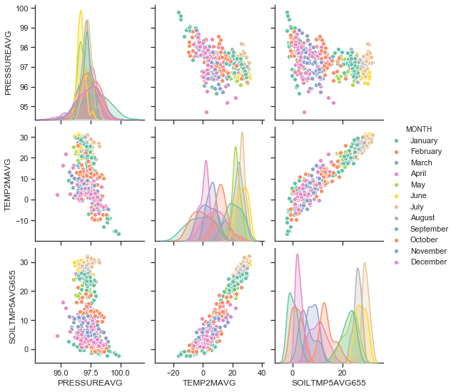
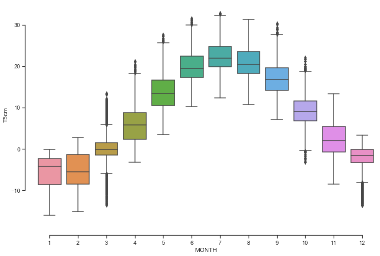

# Seaborn

A module for improved graphics built on top of Matplotlib and that plays nicely with the Pandas library. You can explore an extensive library at the official documentation: <https://seaborn.pydata.org/index.html>


```python
# Import modules
import pandas as pd
import matplotlib.pyplot as plt
import seaborn as sns

```

## Correlogram weather variables


```python
# Load sample weather data
df = pd.read_csv("../datasets/gypsum_ks_daily_2018.csv")
df.fillna(method="bfill", inplace=True)
df.head()

```


<div>
<style scoped>
    .dataframe tbody tr th:only-of-type {
        vertical-align: middle;
    }

    .dataframe tbody tr th {
        vertical-align: top;
    }

    .dataframe thead th {
        text-align: right;
    }
</style>
<table border="1" class="dataframe">
  <thead>
    <tr style="text-align: right;">
      <th></th>
      <th>TIMESTAMP</th>
      <th>STATION</th>
      <th>PRESSUREAVG</th>
      <th>PRESSUREMAX</th>
      <th>PRESSUREMIN</th>
      <th>SLPAVG</th>
      <th>TEMP2MAVG</th>
      <th>TEMP2MMIN</th>
      <th>TEMP2MMAX</th>
      <th>TEMP10MAVG</th>
      <th>...</th>
      <th>SOILTMP10MAX</th>
      <th>SOILTMP10MIN</th>
      <th>SOILTMP5AVG655</th>
      <th>SOILTMP10AVG655</th>
      <th>SOILTMP20AVG655</th>
      <th>SOILTMP50AVG655</th>
      <th>VWC5CM</th>
      <th>VWC10CM</th>
      <th>VWC20CM</th>
      <th>VWC50CM</th>
    </tr>
  </thead>
  <tbody>
    <tr>
      <th>0</th>
      <td>1/1/18 0:00</td>
      <td>Gypsum</td>
      <td>99.44</td>
      <td>100.03</td>
      <td>98.73</td>
      <td>104.44</td>
      <td>-15.15</td>
      <td>-19.56</td>
      <td>-11.00</td>
      <td>-15.31</td>
      <td>...</td>
      <td>-1.18</td>
      <td>-2.45</td>
      <td>-1.33</td>
      <td>-1.14</td>
      <td>0.74</td>
      <td>3.50</td>
      <td>0.1377</td>
      <td>0.1167</td>
      <td>0.2665</td>
      <td>0.2203</td>
    </tr>
    <tr>
      <th>1</th>
      <td>1/2/18 0:00</td>
      <td>Gypsum</td>
      <td>99.79</td>
      <td>100.14</td>
      <td>99.40</td>
      <td>104.88</td>
      <td>-16.48</td>
      <td>-22.10</td>
      <td>-10.40</td>
      <td>-16.38</td>
      <td>...</td>
      <td>-1.56</td>
      <td>-3.46</td>
      <td>-2.10</td>
      <td>-1.82</td>
      <td>0.28</td>
      <td>3.13</td>
      <td>0.1234</td>
      <td>0.1021</td>
      <td>0.2642</td>
      <td>0.2196</td>
    </tr>
    <tr>
      <th>2</th>
      <td>1/3/18 0:00</td>
      <td>Gypsum</td>
      <td>98.87</td>
      <td>99.52</td>
      <td>97.94</td>
      <td>103.81</td>
      <td>-11.03</td>
      <td>-20.64</td>
      <td>-2.71</td>
      <td>-10.66</td>
      <td>...</td>
      <td>-1.49</td>
      <td>-3.61</td>
      <td>-2.21</td>
      <td>-1.93</td>
      <td>-0.08</td>
      <td>2.76</td>
      <td>0.1206</td>
      <td>0.0965</td>
      <td>0.2353</td>
      <td>0.2189</td>
    </tr>
    <tr>
      <th>3</th>
      <td>1/4/18 0:00</td>
      <td>Gypsum</td>
      <td>98.22</td>
      <td>98.54</td>
      <td>97.90</td>
      <td>102.99</td>
      <td>-5.83</td>
      <td>-11.79</td>
      <td>0.24</td>
      <td>-5.01</td>
      <td>...</td>
      <td>-0.98</td>
      <td>-2.67</td>
      <td>-1.60</td>
      <td>-1.46</td>
      <td>-0.21</td>
      <td>2.45</td>
      <td>0.1235</td>
      <td>0.0973</td>
      <td>0.2094</td>
      <td>0.2182</td>
    </tr>
    <tr>
      <th>4</th>
      <td>1/5/18 0:00</td>
      <td>Gypsum</td>
      <td>98.10</td>
      <td>98.42</td>
      <td>97.75</td>
      <td>102.88</td>
      <td>-4.73</td>
      <td>-14.22</td>
      <td>5.36</td>
      <td>-4.23</td>
      <td>...</td>
      <td>-0.72</td>
      <td>-2.81</td>
      <td>-1.54</td>
      <td>-1.38</td>
      <td>-0.25</td>
      <td>2.25</td>
      <td>0.1249</td>
      <td>0.0976</td>
      <td>0.2047</td>
      <td>0.2180</td>
    </tr>
  </tbody>
</table>
<p>5 rows × 44 columns</p>
</div>


```python
# Convert dates to Pandas datetime
df["TIMESTAMP"] = pd.to_datetime(df["TIMESTAMP"], format="%m/%d/%y %H:%M")
df["MONTH"] = df["TIMESTAMP"].dt.month_name()

```


```python
# Create subset with selected variables
df_subset = df[["MONTH","PRESSUREAVG","TEMP2MAVG","SOILTMP5AVG655"]]
df_subset.head()

```


<div>
<style scoped>
    .dataframe tbody tr th:only-of-type {
        vertical-align: middle;
    }

    .dataframe tbody tr th {
        vertical-align: top;
    }

    .dataframe thead th {
        text-align: right;
    }
</style>
<table border="1" class="dataframe">
  <thead>
    <tr style="text-align: right;">
      <th></th>
      <th>MONTH</th>
      <th>PRESSUREAVG</th>
      <th>TEMP2MAVG</th>
      <th>SOILTMP5AVG655</th>
    </tr>
  </thead>
  <tbody>
    <tr>
      <th>0</th>
      <td>January</td>
      <td>99.44</td>
      <td>-15.15</td>
      <td>-1.33</td>
    </tr>
    <tr>
      <th>1</th>
      <td>January</td>
      <td>99.79</td>
      <td>-16.48</td>
      <td>-2.10</td>
    </tr>
    <tr>
      <th>2</th>
      <td>January</td>
      <td>98.87</td>
      <td>-11.03</td>
      <td>-2.21</td>
    </tr>
    <tr>
      <th>3</th>
      <td>January</td>
      <td>98.22</td>
      <td>-5.83</td>
      <td>-1.60</td>
    </tr>
    <tr>
      <th>4</th>
      <td>January</td>
      <td>98.10</td>
      <td>-4.73</td>
      <td>-1.54</td>
    </tr>
  </tbody>
</table>
</div>


```python
# Create correlogram
sns.pairplot(df_subset, kind="scatter", hue="MONTH", palette="Set2")
plt.show()

```





## Heatmap Coronavirus


```python
# Load data
df_confirmed = pd.read_csv("../datasets/coronavirus_main_affected_regions_confirmed.csv")
df_recovered = pd.read_csv("../datasets/coronavirus_main_affected_regions_recovered.csv")

# Set Countr/Region as the index
df_confirmed.set_index("Country/Region", inplace=True)
df_recovered.set_index("Country/Region", inplace=True)

# Subtract the dataframes (they have the same number of rows and columns)
df_change = df_confirmed.subtract(df_recovered)
df_change.head()

```


<div>
<style scoped>
    .dataframe tbody tr th:only-of-type {
        vertical-align: middle;
    }

    .dataframe tbody tr th {
        vertical-align: top;
    }

    .dataframe thead th {
        text-align: right;
    }
</style>
<table border="1" class="dataframe">
  <thead>
    <tr style="text-align: right;">
      <th></th>
      <th>Lat</th>
      <th>Long</th>
      <th>22-Jan-2020</th>
      <th>23-Jan-2020</th>
      <th>24-Jan-2020</th>
      <th>25-Jan-2020</th>
      <th>26-Jan-2020</th>
      <th>27-Jan-2020</th>
      <th>28-Jan-2020</th>
      <th>29-Jan-2020</th>
      <th>...</th>
      <th>14-Mar-2020</th>
      <th>15-Mar-2020</th>
      <th>16-Mar-2020</th>
      <th>17-Mar-2020</th>
      <th>18-Mar-2020</th>
      <th>19-Mar-2020</th>
      <th>20-Mar-2020</th>
      <th>21-Mar-2020</th>
      <th>22-Mar-2020</th>
      <th>23-Mar-2020</th>
    </tr>
    <tr>
      <th>Country/Region</th>
      <th></th>
      <th></th>
      <th></th>
      <th></th>
      <th></th>
      <th></th>
      <th></th>
      <th></th>
      <th></th>
      <th></th>
      <th></th>
      <th></th>
      <th></th>
      <th></th>
      <th></th>
      <th></th>
      <th></th>
      <th></th>
      <th></th>
      <th></th>
      <th></th>
    </tr>
  </thead>
  <tbody>
    <tr>
      <th>Japan</th>
      <td>0.0</td>
      <td>0.0</td>
      <td>2</td>
      <td>1</td>
      <td>2</td>
      <td>2</td>
      <td>3</td>
      <td>3</td>
      <td>6</td>
      <td>6</td>
      <td>...</td>
      <td>655</td>
      <td>721</td>
      <td>681</td>
      <td>734</td>
      <td>745</td>
      <td>774</td>
      <td>772</td>
      <td>775</td>
      <td>851</td>
      <td>851</td>
    </tr>
    <tr>
      <th>Italy</th>
      <td>0.0</td>
      <td>0.0</td>
      <td>0</td>
      <td>0</td>
      <td>0</td>
      <td>0</td>
      <td>0</td>
      <td>0</td>
      <td>0</td>
      <td>0</td>
      <td>...</td>
      <td>19191</td>
      <td>22412</td>
      <td>25231</td>
      <td>28565</td>
      <td>31688</td>
      <td>36595</td>
      <td>42581</td>
      <td>47506</td>
      <td>52114</td>
      <td>52114</td>
    </tr>
    <tr>
      <th>Spain</th>
      <td>0.0</td>
      <td>0.0</td>
      <td>0</td>
      <td>0</td>
      <td>0</td>
      <td>0</td>
      <td>0</td>
      <td>0</td>
      <td>0</td>
      <td>0</td>
      <td>...</td>
      <td>5874</td>
      <td>7281</td>
      <td>9412</td>
      <td>10720</td>
      <td>12829</td>
      <td>16856</td>
      <td>18822</td>
      <td>23249</td>
      <td>26193</td>
      <td>26193</td>
    </tr>
    <tr>
      <th>Egypt</th>
      <td>0.0</td>
      <td>0.0</td>
      <td>0</td>
      <td>0</td>
      <td>0</td>
      <td>0</td>
      <td>0</td>
      <td>0</td>
      <td>0</td>
      <td>0</td>
      <td>...</td>
      <td>82</td>
      <td>89</td>
      <td>123</td>
      <td>164</td>
      <td>164</td>
      <td>224</td>
      <td>246</td>
      <td>253</td>
      <td>271</td>
      <td>271</td>
    </tr>
    <tr>
      <th>Switzerland</th>
      <td>0.0</td>
      <td>0.0</td>
      <td>0</td>
      <td>0</td>
      <td>0</td>
      <td>0</td>
      <td>0</td>
      <td>0</td>
      <td>0</td>
      <td>0</td>
      <td>...</td>
      <td>1355</td>
      <td>2196</td>
      <td>2196</td>
      <td>2696</td>
      <td>3013</td>
      <td>4060</td>
      <td>5279</td>
      <td>6560</td>
      <td>7114</td>
      <td>7114</td>
    </tr>
  </tbody>
</table>
<p>5 rows × 64 columns</p>
</div>


```python
# Create heatmap
plt.figure(figsize=(14,10))
sns.heatmap(df_change, linewidths=0.1, cmap="YlGnBu")
plt.show()

```


## Heatmap soil temperature


```python
# Load data
df = pd.read_csv("../datasets/fargo_hourly_deep_soil_temperature.csv")

# Convert dates to Pandas datetime format
df["time_cst"] = pd.to_datetime(df["time_cst"], format="%m/%d/%y %H:%M")

# Summarize data by month
df["MONTH"] = df["time_cst"].dt.month
df_grouped = df.groupby(["MONTH"]).mean().round(2)
df_grouped.head()

```


<div>
<style scoped>
    .dataframe tbody tr th:only-of-type {
        vertical-align: middle;
    }

    .dataframe tbody tr th {
        vertical-align: top;
    }

    .dataframe thead th {
        text-align: right;
    }
</style>
<table border="1" class="dataframe">
  <thead>
    <tr style="text-align: right;">
      <th></th>
      <th>T5cm</th>
      <th>T10cm</th>
      <th>T20cm</th>
      <th>T30cm</th>
      <th>T40cm</th>
      <th>T50cm</th>
      <th>T60cm</th>
      <th>T80cm</th>
      <th>T100cm</th>
      <th>T125cm</th>
      <th>T150cm</th>
      <th>T175cm</th>
      <th>T200cm</th>
      <th>T225cm</th>
    </tr>
    <tr>
      <th>MONTH</th>
      <th></th>
      <th></th>
      <th></th>
      <th></th>
      <th></th>
      <th></th>
      <th></th>
      <th></th>
      <th></th>
      <th></th>
      <th></th>
      <th></th>
      <th></th>
      <th></th>
    </tr>
  </thead>
  <tbody>
    <tr>
      <th>1</th>
      <td>-5.39</td>
      <td>-4.80</td>
      <td>-3.75</td>
      <td>-2.76</td>
      <td>-1.84</td>
      <td>-1.00</td>
      <td>-0.20</td>
      <td>1.20</td>
      <td>2.36</td>
      <td>3.60</td>
      <td>4.63</td>
      <td>5.51</td>
      <td>6.33</td>
      <td>6.96</td>
    </tr>
    <tr>
      <th>2</th>
      <td>-5.41</td>
      <td>-4.98</td>
      <td>-4.17</td>
      <td>-3.43</td>
      <td>-2.74</td>
      <td>-2.06</td>
      <td>-1.38</td>
      <td>-0.17</td>
      <td>0.83</td>
      <td>1.89</td>
      <td>2.83</td>
      <td>3.69</td>
      <td>4.54</td>
      <td>5.26</td>
    </tr>
    <tr>
      <th>3</th>
      <td>0.14</td>
      <td>-0.17</td>
      <td>-0.52</td>
      <td>-0.66</td>
      <td>-0.65</td>
      <td>-0.56</td>
      <td>-0.42</td>
      <td>-0.01</td>
      <td>0.48</td>
      <td>1.14</td>
      <td>1.85</td>
      <td>2.56</td>
      <td>3.41</td>
      <td>4.07</td>
    </tr>
    <tr>
      <th>4</th>
      <td>5.82</td>
      <td>5.03</td>
      <td>3.94</td>
      <td>3.11</td>
      <td>2.51</td>
      <td>2.07</td>
      <td>1.77</td>
      <td>1.49</td>
      <td>1.48</td>
      <td>1.73</td>
      <td>2.08</td>
      <td>2.48</td>
      <td>3.12</td>
      <td>3.58</td>
    </tr>
    <tr>
      <th>5</th>
      <td>13.66</td>
      <td>12.60</td>
      <td>11.16</td>
      <td>10.04</td>
      <td>9.11</td>
      <td>8.29</td>
      <td>7.56</td>
      <td>6.35</td>
      <td>5.49</td>
      <td>4.76</td>
      <td>4.31</td>
      <td>4.08</td>
      <td>4.18</td>
      <td>4.21</td>
    </tr>
  </tbody>
</table>
</div>


```python
# Create Heatmap
plt.figure(figsize=(14,10))
sns.heatmap(df_grouped.T, annot=True, linewidths=1, cmap="RdBu_r")
plt.show()

```


## Boxplot


```python
# Draw a nested boxplot to show bills by day and time
plt.figure(figsize=(12,8))
sns.boxplot(x="MONTH", y="T5cm", data=df, )
sns.despine(offset=20, trim=True)

```




