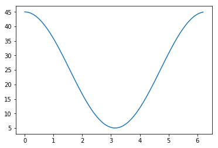
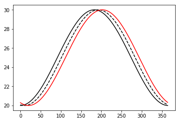
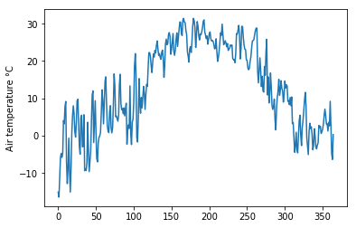
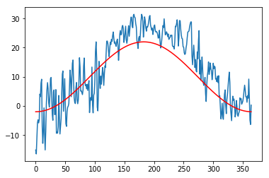
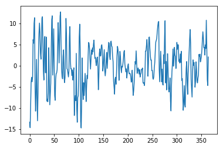

```python
%matplotlib inline
import pandas as pd
import numpy as np
import matplotlib.pyplot as plt
from scipy.optimize import curve_fit
```


```python
x = np.arange(0,2*np.pi,0.1)
super_simple_wave = lambda x, a, b: a + b * np.cos(x)

plt.plot(x, super_simple_wave(x, 25, 20))
plt.show()
```





```python
simple_wave = lambda x, a, b: a + b * np.cos(2*np.pi*(x)/365)
doy = np.arange(0,365,1)

plt.plot(doy, simple_wave(doy, 25, 20), '-k')
plt.plot(doy, simple_wave(doy, 5, 20), '--b')
plt.plot(doy, simple_wave(doy, 25, 5), '--r')
plt.show()

# Peak is at 0 DOY and minimum is at 182 (pi, 2*pi*182/365)

print(np.argmax(simple_wave(doy, 25, 20)))
print(np.argmin(simple_wave(doy, 25, 20)))
```


    0
    182


```python
# How do we shift the curve?
# Add new parameter c
# c means day of highest temperature since July 1 (DOY 182)
# Shift by pi (half way). If we shift by 2*pi we will end up in the same location
wave = lambda x, a, b, c: a + b * np.cos(2*np.pi*(x-c)/365 - np.pi)

plt.plot(doy, wave(doy, 25, 5, 0), '-k')
plt.plot(doy, wave(doy, 25, 5, 10), '--k')
plt.plot(doy, wave(doy, 25, 5, 20), '-r')
plt.show()
```





```python
# Fit temperature model to actual temperature data
mesonet_data = pd.read_csv("/Users/andrespatrignani/Dropbox/Teaching/Scientific programming/introcoding-spring-2019/Datasets/gypsum_ks_daily_2018.csv")
mesonet_data.head(5)

```


<div>
<style scoped>
    .dataframe tbody tr th:only-of-type {
        vertical-align: middle;
    }

    .dataframe tbody tr th {
        vertical-align: top;
    }

    .dataframe thead th {
        text-align: right;
    }
</style>
<table border="1" class="dataframe">
  <thead>
    <tr style="text-align: right;">
      <th></th>
      <th>TIMESTAMP</th>
      <th>STATION</th>
      <th>PRESSUREAVG</th>
      <th>PRESSUREMAX</th>
      <th>PRESSUREMIN</th>
      <th>SLPAVG</th>
      <th>TEMP2MAVG</th>
      <th>TEMP2MMIN</th>
      <th>TEMP2MMAX</th>
      <th>TEMP10MAVG</th>
      <th>...</th>
      <th>SOILTMP10MAX</th>
      <th>SOILTMP10MIN</th>
      <th>SOILTMP5AVG655</th>
      <th>SOILTMP10AVG655</th>
      <th>SOILTMP20AVG655</th>
      <th>SOILTMP50AVG655</th>
      <th>VWC5CM</th>
      <th>VWC10CM</th>
      <th>VWC20CM</th>
      <th>VWC50CM</th>
    </tr>
  </thead>
  <tbody>
    <tr>
      <th>0</th>
      <td>1/1/18 0:00</td>
      <td>Gypsum</td>
      <td>99.44</td>
      <td>100.03</td>
      <td>98.73</td>
      <td>104.44</td>
      <td>-15.15</td>
      <td>-19.56</td>
      <td>-11.00</td>
      <td>-15.31</td>
      <td>...</td>
      <td>-1.18</td>
      <td>-2.45</td>
      <td>-1.33</td>
      <td>-1.14</td>
      <td>0.74</td>
      <td>3.50</td>
      <td>0.1377</td>
      <td>0.1167</td>
      <td>0.2665</td>
      <td>0.2203</td>
    </tr>
    <tr>
      <th>1</th>
      <td>1/2/18 0:00</td>
      <td>Gypsum</td>
      <td>99.79</td>
      <td>100.14</td>
      <td>99.40</td>
      <td>104.88</td>
      <td>-16.48</td>
      <td>-22.10</td>
      <td>-10.40</td>
      <td>-16.38</td>
      <td>...</td>
      <td>-1.56</td>
      <td>-3.46</td>
      <td>-2.10</td>
      <td>-1.82</td>
      <td>0.28</td>
      <td>3.13</td>
      <td>0.1234</td>
      <td>0.1021</td>
      <td>0.2642</td>
      <td>0.2196</td>
    </tr>
    <tr>
      <th>2</th>
      <td>1/3/18 0:00</td>
      <td>Gypsum</td>
      <td>98.87</td>
      <td>99.52</td>
      <td>97.94</td>
      <td>103.81</td>
      <td>-11.03</td>
      <td>-20.64</td>
      <td>-2.71</td>
      <td>-10.66</td>
      <td>...</td>
      <td>-1.49</td>
      <td>-3.61</td>
      <td>-2.21</td>
      <td>-1.93</td>
      <td>-0.08</td>
      <td>2.76</td>
      <td>0.1206</td>
      <td>0.0965</td>
      <td>0.2353</td>
      <td>0.2189</td>
    </tr>
    <tr>
      <th>3</th>
      <td>1/4/18 0:00</td>
      <td>Gypsum</td>
      <td>98.22</td>
      <td>98.54</td>
      <td>97.90</td>
      <td>102.99</td>
      <td>-5.83</td>
      <td>-11.79</td>
      <td>0.24</td>
      <td>-5.01</td>
      <td>...</td>
      <td>-0.98</td>
      <td>-2.67</td>
      <td>-1.60</td>
      <td>-1.46</td>
      <td>-0.21</td>
      <td>2.45</td>
      <td>0.1235</td>
      <td>0.0973</td>
      <td>0.2094</td>
      <td>0.2182</td>
    </tr>
    <tr>
      <th>4</th>
      <td>1/5/18 0:00</td>
      <td>Gypsum</td>
      <td>98.10</td>
      <td>98.42</td>
      <td>97.75</td>
      <td>102.88</td>
      <td>-4.73</td>
      <td>-14.22</td>
      <td>5.36</td>
      <td>-4.23</td>
      <td>...</td>
      <td>-0.72</td>
      <td>-2.81</td>
      <td>-1.54</td>
      <td>-1.38</td>
      <td>-0.25</td>
      <td>2.25</td>
      <td>0.1249</td>
      <td>0.0976</td>
      <td>0.2047</td>
      <td>0.2180</td>
    </tr>
  </tbody>
</table>
<p>5 rows × 44 columns</p>
</div>


```python
mesonet_data.TEMP2MAVG.fillna(method='ffill', inplace=True)
```


```python
plt.plot(mesonet_data.TEMP2MAVG)
plt.ylabel("Air temperature " + u"\N{DEGREE SIGN}" + "C")
```


    Text(0,0.5,'Air temperature °C')





```python
plt.plot(mesonet_data.TEMP2MAVG)
plt.plot(doy, wave(doy, 10, 12, 0), '-r')
plt.show()
```





```python
# Fit sinusoidal model
lb = [-10,5,0]
ub = [20,30,365]
par0 = [10,10,10]

par = curve_fit(wave, doy, mesonet_data.TEMP2MAVG, par0, bounds=(lb,ub))
print(par[0])

```

    [12.6619452  14.81119575 12.45559217]


```python
plt.plot(mesonet_data.TEMP2MAVG)
plt.plot(wave(doy, *par[0]))
plt.show()

```


```python
residuals = mesonet_data.TEMP2MAVG - wave(doy, *par[0])
print(residuals.mean())

```

    4.642629090300308e-09


```python
plt.plot(residuals)
plt.show()
```




