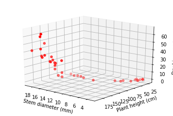
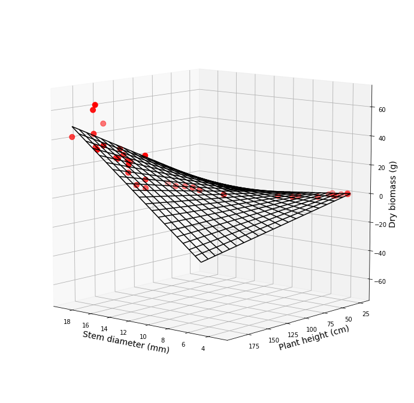

# **Multiple Linear Regression Analysis**


```python
%matplotlib inline
import pandas as pd
import numpy as np
import matplotlib.pyplot as plt
from mpl_toolkits import mplot3d

import statsmodels.api as sm
```


```python
data = pd.read_csv("/Users/andrespatrignani/Dropbox/Teaching/Scientific programming/introcoding-spring-2019/Datasets/corn_allometric_biomass.csv")
data.head(5)

```


<div>
<style scoped>
    .dataframe tbody tr th:only-of-type {
        vertical-align: middle;
    }

    .dataframe tbody tr th {
        vertical-align: top;
    }

    .dataframe thead th {
        text-align: right;
    }
</style>
<table border="1" class="dataframe">
  <thead>
    <tr style="text-align: right;">
      <th></th>
      <th>height_cm</th>
      <th>stem_diam_mm</th>
      <th>dry_biomass_g</th>
    </tr>
  </thead>
  <tbody>
    <tr>
      <th>0</th>
      <td>71.0</td>
      <td>5.7</td>
      <td>0.66</td>
    </tr>
    <tr>
      <th>1</th>
      <td>39.0</td>
      <td>4.4</td>
      <td>0.19</td>
    </tr>
    <tr>
      <th>2</th>
      <td>55.5</td>
      <td>4.3</td>
      <td>0.30</td>
    </tr>
    <tr>
      <th>3</th>
      <td>41.5</td>
      <td>3.7</td>
      <td>0.16</td>
    </tr>
    <tr>
      <th>4</th>
      <td>40.0</td>
      <td>3.6</td>
      <td>0.14</td>
    </tr>
  </tbody>
</table>
</div>


```python
# Plot raw dataa and fitted model
# Necessary import for 3d plots.
# Great tutorial: https://jakevdp.github.io/PythonDataScienceHandbook/04.12-three-dimensional-plotting.html

fig = plt.figure()
ax = plt.axes(projection='3d')

# Data for three-dimensional scattered points
zdata = data.dry_biomass_g
xdata = data.stem_diam_mm
ydata = data.height_cm
ax.scatter3D(xdata, ydata, zdata, c='r');
ax.set_xlabel('Stem diameter (mm)')
ax.set_ylabel('Plant height (cm)')
ax.set_zlabel('Dry biomass (g)')

ax.view_init(elev=20, azim=130)
plt.show()

# elev=None, azim=None
# elev = elevation angle in the z plane.
# azim = stores the azimuth angle in the x,y plane.
```





```python
# Multiple Linear Regression using Python- and Matlab-style formula input
# Requires specifying the intercept using an array of ones.

X = np.column_stack((np.ones(data.shape[0]),
                     data.height_cm,data.stem_diam_mm,
                     data.height_cm*data.stem_diam_mm))

model = sm.OLS(data.dry_biomass_g, X)
results = model.fit()
print(results.summary())
```

                                OLS Regression Results                            
    ==============================================================================
    Dep. Variable:          dry_biomass_g   R-squared:                       0.849
    Model:                            OLS   Adj. R-squared:                  0.836
    Method:                 Least Squares   F-statistic:                     63.71
    Date:                Sat, 20 Apr 2019   Prob (F-statistic):           4.87e-14
    Time:                        20:39:53   Log-Likelihood:                -129.26
    No. Observations:                  38   AIC:                             266.5
    Df Residuals:                      34   BIC:                             273.1
    Df Model:                           3                                         
    Covariance Type:            nonrobust                                         
    ==============================================================================
                     coef    std err          t      P>|t|      [0.025      0.975]
    ------------------------------------------------------------------------------
    const         18.8097      6.022      3.124      0.004       6.572      31.048
    x1            -0.1830      0.119     -1.541      0.133      -0.424       0.058
    x2            -4.5537      1.222     -3.727      0.001      -7.037      -2.070
    x3             0.0433      0.007      6.340      0.000       0.029       0.057
    ==============================================================================
    Omnibus:                        9.532   Durbin-Watson:                   2.076
    Prob(Omnibus):                  0.009   Jarque-Bera (JB):                9.232
    Skew:                           0.861   Prob(JB):                      0.00989
    Kurtosis:                       4.692   Cond. No.                     1.01e+04
    ==============================================================================
    
    Warnings:
    [1] Standard Errors assume that the covariance matrix of the errors is correctly specified.
    [2] The condition number is large, 1.01e+04. This might indicate that there are
    strong multicollinearity or other numerical problems.


>Height (x1) does not seem to be significant (high p-value and ranges including zero value). Run again prunning non-significant variables. Cannot remove the variables and use previous coefficients!


```python
# Run a prunned model
X = np.column_stack((np.ones(data.shape[0]),data.stem_diam_mm,data.height_cm*data.stem_diam_mm))

model_prunned = sm.OLS(data.dry_biomass_g, X)
results_prunned = model_prunned.fit()
print(results_prunned.summary())

results_prunned.params

# New fitting has:
# r-squared remains similar
# one less parameter
# Higher F-Statistic 90 vs 63
# AIC remains similar
```

                                OLS Regression Results                            
    ==============================================================================
    Dep. Variable:          dry_biomass_g   R-squared:                       0.838
    Model:                            OLS   Adj. R-squared:                  0.829
    Method:                 Least Squares   F-statistic:                     90.81
    Date:                Sat, 20 Apr 2019   Prob (F-statistic):           1.40e-14
    Time:                        20:39:54   Log-Likelihood:                -130.54
    No. Observations:                  38   AIC:                             267.1
    Df Residuals:                      35   BIC:                             272.0
    Df Model:                           2                                         
    Covariance Type:            nonrobust                                         
    ==============================================================================
                     coef    std err          t      P>|t|      [0.025      0.975]
    ------------------------------------------------------------------------------
    const         14.0338      5.263      2.666      0.012       3.349      24.719
    x1            -5.0922      1.194     -4.266      0.000      -7.515      -2.669
    x2             0.0367      0.005      6.761      0.000       0.026       0.048
    ==============================================================================
    Omnibus:                       12.121   Durbin-Watson:                   2.194
    Prob(Omnibus):                  0.002   Jarque-Bera (JB):               13.505
    Skew:                           0.997   Prob(JB):                      0.00117
    Kurtosis:                       5.135   Cond. No.                     8.80e+03
    ==============================================================================
    
    Warnings:
    [1] Standard Errors assume that the covariance matrix of the errors is correctly specified.
    [2] The condition number is large, 8.8e+03. This might indicate that there are
    strong multicollinearity or other numerical problems.


    const    14.033781
    x1       -5.092159
    x2        0.036719
    dtype: float64


```python
# Plot points with predicted model (which is a surface)

fig = plt.figure(figsize=(12,12))
ax = plt.axes(projection='3d')

# Data for three-dimensional scattered points (same code as in previous plot)
zdata = data.dry_biomass_g
xdata = data.stem_diam_mm
ydata = data.height_cm
ax.scatter3D(xdata, ydata, zdata, c='r', s=80);
ax.set_xlabel('Stem diameter (mm)')
ax.set_ylabel('Plant height (cm)')
ax.set_zlabel('Dry biomass (g)')

# Xgrid is grid of stem diameter
x = np.linspace(data.stem_diam_mm.min(), data.stem_diam_mm.max(), 21)

# Ygrid is grid of plant height
y = np.linspace(data.height_cm.min(), data.height_cm.max(), 21)

# We generate a 2D grid
Xgrid, Ygrid = np.meshgrid(x, y)

intercept = np.ones(Xgrid.shape)

# Z is the elevation of this 2D grid
# You can also use the sm.OLS.predict() method but I decided  to do it this way to show 
# few more details
Zgrid = intercept*results_prunned.params[0] + Xgrid*results_prunned.params[1] + Xgrid*Ygrid*results_prunned.params[2]

# Plot the data
surf = ax.plot_wireframe(Xgrid, Ygrid, Zgrid, color='black')
# Alternative:
#surf = ax.plot_surface(Xgrid, Ygrid, Zgrid, cmap=plt.cm.coolwarm,rstride=1, cstride=1)
ax.set_xlabel('Stem diameter (mm)',fontsize=14)
ax.set_ylabel('Plant height (cm)',fontsize=14)
ax.set_zlabel('Dry biomass (g)',fontsize=14)

ax.view_init(10, 130)


```




