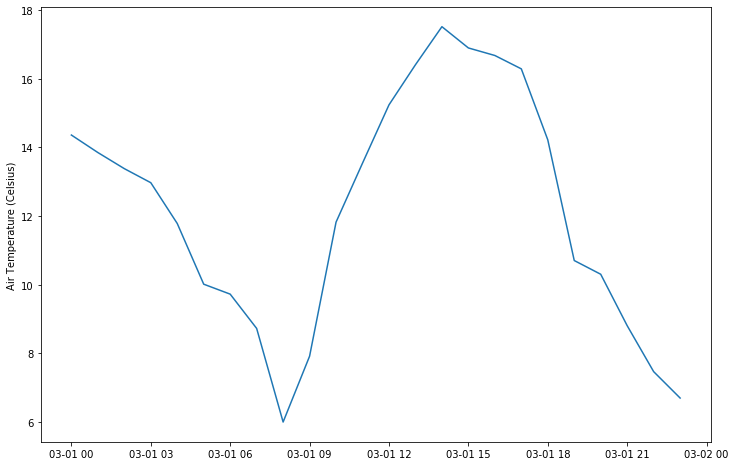

# Read environmental data from an online source (Script)

In this example we will learn to download data from the Kansas mesonet. Data can be accessed through a URL (Uniform Resource Locator), which is also known as a web address. In this URL we are going to pass some parameters to specify the location, date, and interval of the data. For services that output their data in comma-separated values we can use the Pandas library.


**Note**:Some web services (e.g. openweathermap or dark sky) require a token (a user-specific key similar to a password) in order to use the service. Depending on the amount of data requested you might be able to use the service for free.


Representational State Transfer (REST). Find out more at <https://www.wikiwand.com/en/Representational_state_transfer>

Kansas mesonet REST API: http://mesonet.k-state.edu/rest/

Author: Andres Patrignani <br/>
Last updated: 14-Oct-2018


```python
# Import packages
import pandas as pd
```


```python
stn = 'Manhattan';
interval = 'hour'; # Options: day, hour, 5min;
start_time = '20200301000000';
end_time =   '20200301235900';

root = 'http://mesonet.k-state.edu/rest/stationdata/?'
url = root + 'stn=' + stn + '&int=' + interval + '&t_start=' + start_time + '&t_end=' + end_time;
print(url)
```

    http://mesonet.k-state.edu/rest/stationdata/?stn=Manhattan&int=hour&t_start=20200301000000&t_end=20200301235900


```python
# Let's inspect the first five rows
df = pd.read_csv(url)
df.head(3)

```


<div>
<style scoped>
    .dataframe tbody tr th:only-of-type {
        vertical-align: middle;
    }

    .dataframe tbody tr th {
        vertical-align: top;
    }

    .dataframe thead th {
        text-align: right;
    }
</style>
<table border="1" class="dataframe">
  <thead>
    <tr style="text-align: right;">
      <th></th>
      <th>TIMESTAMP</th>
      <th>STATION</th>
      <th>PRESSUREAVG</th>
      <th>SLPAVG</th>
      <th>TEMP2MAVG</th>
      <th>TEMP10MAVG</th>
      <th>RELHUM2MAVG</th>
      <th>RELHUM10MAVG</th>
      <th>VPDEFAVG</th>
      <th>PRECIP</th>
      <th>...</th>
      <th>SOILPA20CM</th>
      <th>SOILPA50CM</th>
      <th>SOILVR5CM</th>
      <th>SOILVR10CM</th>
      <th>SOILVR20CM</th>
      <th>SOILVR50CM</th>
      <th>VWC5CM</th>
      <th>VWC10CM</th>
      <th>VWC20CM</th>
      <th>VWC50CM</th>
    </tr>
  </thead>
  <tbody>
    <tr>
      <th>0</th>
      <td>2020-03-01 00:00:00</td>
      <td>Manhattan</td>
      <td>96.82</td>
      <td>100.67</td>
      <td>14.36</td>
      <td>14.91</td>
      <td>31.28</td>
      <td>29.45</td>
      <td>1.12</td>
      <td>0.0</td>
      <td>...</td>
      <td>1.8785</td>
      <td>2.0797</td>
      <td>1.2737</td>
      <td>1.2756</td>
      <td>1.3145</td>
      <td>1.7303</td>
      <td>0.40292</td>
      <td>0.40970</td>
      <td>0.41620</td>
      <td>0.4949</td>
    </tr>
    <tr>
      <th>1</th>
      <td>2020-03-01 01:00:00</td>
      <td>Manhattan</td>
      <td>96.77</td>
      <td>100.62</td>
      <td>13.85</td>
      <td>14.44</td>
      <td>33.59</td>
      <td>31.94</td>
      <td>1.05</td>
      <td>0.0</td>
      <td>...</td>
      <td>1.8785</td>
      <td>2.0797</td>
      <td>1.2730</td>
      <td>1.2751</td>
      <td>1.3146</td>
      <td>1.7308</td>
      <td>0.40283</td>
      <td>0.40970</td>
      <td>0.41621</td>
      <td>0.4949</td>
    </tr>
    <tr>
      <th>2</th>
      <td>2020-03-01 02:00:00</td>
      <td>Manhattan</td>
      <td>96.72</td>
      <td>100.57</td>
      <td>13.38</td>
      <td>13.94</td>
      <td>35.67</td>
      <td>34.12</td>
      <td>0.99</td>
      <td>0.0</td>
      <td>...</td>
      <td>1.8785</td>
      <td>2.0797</td>
      <td>1.2724</td>
      <td>1.2749</td>
      <td>1.3151</td>
      <td>1.7315</td>
      <td>0.40287</td>
      <td>0.40927</td>
      <td>0.41620</td>
      <td>0.4949</td>
    </tr>
  </tbody>
</table>
<p>3 rows × 44 columns</p>
</div>


```python
print(df.shape)
print(df.size)

```

    (7, 60)
    420


```python
# Let's also inspect the format of some variables
print(type(df.TIMESTAMP[0]))
print(type(df.PRESSUREAVG[0]))
```

    <class 'str'>
    <class 'numpy.float64'>


```python
df['TIMESTAMP'] = pd.to_datetime(df["TIMESTAMP"], format='%Y-%m-%d %H:%M:%S')
df.head(5)

```


<div>
<style scoped>
    .dataframe tbody tr th:only-of-type {
        vertical-align: middle;
    }

    .dataframe tbody tr th {
        vertical-align: top;
    }

    .dataframe thead th {
        text-align: right;
    }
</style>
<table border="1" class="dataframe">
  <thead>
    <tr style="text-align: right;">
      <th></th>
      <th>TIMESTAMP</th>
      <th>STATION</th>
      <th>PRESSUREAVG</th>
      <th>SLPAVG</th>
      <th>TEMP2MAVG</th>
      <th>TEMP10MAVG</th>
      <th>RELHUM2MAVG</th>
      <th>RELHUM10MAVG</th>
      <th>VPDEFAVG</th>
      <th>PRECIP</th>
      <th>...</th>
      <th>SOILPA20CM</th>
      <th>SOILPA50CM</th>
      <th>SOILVR5CM</th>
      <th>SOILVR10CM</th>
      <th>SOILVR20CM</th>
      <th>SOILVR50CM</th>
      <th>VWC5CM</th>
      <th>VWC10CM</th>
      <th>VWC20CM</th>
      <th>VWC50CM</th>
    </tr>
  </thead>
  <tbody>
    <tr>
      <th>0</th>
      <td>2020-03-01 00:00:00</td>
      <td>Manhattan</td>
      <td>96.82</td>
      <td>100.67</td>
      <td>14.36</td>
      <td>14.91</td>
      <td>31.28</td>
      <td>29.45</td>
      <td>1.12</td>
      <td>0.0</td>
      <td>...</td>
      <td>1.8785</td>
      <td>2.0797</td>
      <td>1.2737</td>
      <td>1.2756</td>
      <td>1.3145</td>
      <td>1.7303</td>
      <td>0.40292</td>
      <td>0.40970</td>
      <td>0.41620</td>
      <td>0.49490</td>
    </tr>
    <tr>
      <th>1</th>
      <td>2020-03-01 01:00:00</td>
      <td>Manhattan</td>
      <td>96.77</td>
      <td>100.62</td>
      <td>13.85</td>
      <td>14.44</td>
      <td>33.59</td>
      <td>31.94</td>
      <td>1.05</td>
      <td>0.0</td>
      <td>...</td>
      <td>1.8785</td>
      <td>2.0797</td>
      <td>1.2730</td>
      <td>1.2751</td>
      <td>1.3146</td>
      <td>1.7308</td>
      <td>0.40283</td>
      <td>0.40970</td>
      <td>0.41621</td>
      <td>0.49490</td>
    </tr>
    <tr>
      <th>2</th>
      <td>2020-03-01 02:00:00</td>
      <td>Manhattan</td>
      <td>96.72</td>
      <td>100.57</td>
      <td>13.38</td>
      <td>13.94</td>
      <td>35.67</td>
      <td>34.12</td>
      <td>0.99</td>
      <td>0.0</td>
      <td>...</td>
      <td>1.8785</td>
      <td>2.0797</td>
      <td>1.2724</td>
      <td>1.2749</td>
      <td>1.3151</td>
      <td>1.7315</td>
      <td>0.40287</td>
      <td>0.40927</td>
      <td>0.41620</td>
      <td>0.49490</td>
    </tr>
    <tr>
      <th>3</th>
      <td>2020-03-01 03:00:00</td>
      <td>Manhattan</td>
      <td>96.66</td>
      <td>100.52</td>
      <td>12.97</td>
      <td>13.60</td>
      <td>37.17</td>
      <td>35.51</td>
      <td>0.94</td>
      <td>0.0</td>
      <td>...</td>
      <td>1.8785</td>
      <td>2.0797</td>
      <td>1.2716</td>
      <td>1.2747</td>
      <td>1.3152</td>
      <td>1.7322</td>
      <td>0.40274</td>
      <td>0.40920</td>
      <td>0.41620</td>
      <td>0.49489</td>
    </tr>
    <tr>
      <th>4</th>
      <td>2020-03-01 04:00:00</td>
      <td>Manhattan</td>
      <td>96.64</td>
      <td>100.50</td>
      <td>11.78</td>
      <td>12.53</td>
      <td>40.96</td>
      <td>39.16</td>
      <td>0.82</td>
      <td>0.0</td>
      <td>...</td>
      <td>1.8785</td>
      <td>2.0797</td>
      <td>1.2706</td>
      <td>1.2742</td>
      <td>1.3153</td>
      <td>1.7326</td>
      <td>0.40286</td>
      <td>0.40920</td>
      <td>0.41621</td>
      <td>0.49488</td>
    </tr>
  </tbody>
</table>
<p>5 rows × 44 columns</p>
</div>


```python
import matplotlib.pyplot as plt

plt.figure(figsize=(12,8))
plt.plot(df["TIMESTAMP"], df["TEMP2MAVG"])
plt.ylabel('Air Temperature (Celsius)')
plt.show()

```




