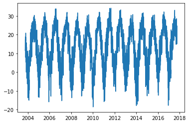
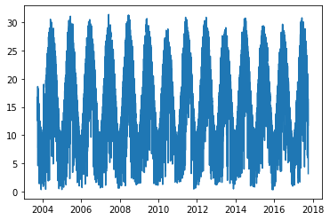
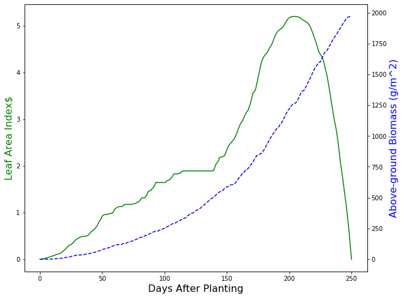
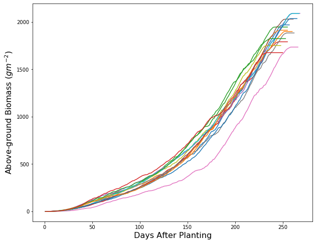
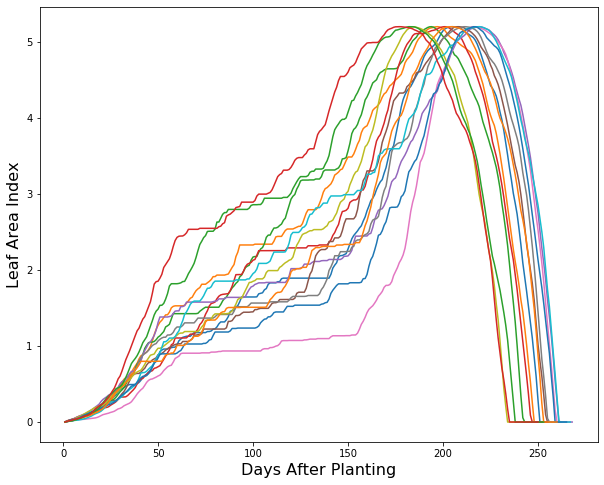

# Modeling Wheat Biomass

In this exercise we will simulate the dry biomass of winter wheat using a simple model that rely on thermal time and some crop-specific coefficients.

THere is only one variable that changes in this model, the amount of dry biomass at time $t$. This is called a state variable, because it represents the state or condition of a physical object or process.

The iterative model computes dry biomass at time $t$ based on the available biomass at $t-1$ and the ability of the existing biomass to generate new plant growth. So, the rate of growth is determined by the exsting biomass and the weather conditions. In this model we will assume that there are no environmental limitations other than the input in solar radiation and the changes in air temperature.

The equation modeling the increase in aboveground dry biomass as a function of the intercepted incident solar radiation is:

$$ B_t = B_{t-1} + E_b \; E_{imax} \Bigg[ 1 - e^{-K \; LAI_t} \Bigg] PAR_t$$


The equation modeling the leaf area index as a function of thermal time is:

$$ LAI_t = L_{max} \Bigg[ \frac{1}{1+e^{-\alpha(T_t - T_1)}} -e^{\beta(T_t-T_2)} \Bigg]$$


where the parameter $T_2$ is defined by:

$$ T_2 = \frac{1}{\beta} log[1 + e^{(\alpha \; T_1)}]$$


$B$ is above-ground dry biomass in $g m^{-2}$
$T$ is cumulative growing degree days

$t$ is time in days

$LAI$ is the leaf area index

$L{max}$ is the maximum leaf area index during the entire growing season.

$PAR$ is the photosynthetically active radiation

$K$ is the coefficient of extiction

$T_1$ is a growth threshold

$E_b$ is the radiation use efficiency

$E_{imax}$ is the maximal value of intercepted to incident solar radiation 

$\alpha$ and $\beta$ are empirical parameters


```python
# Import modules
import pandas as pd
import numpy as np
import matplotlib.pyplot as plt

```


```python
# Import data
df = pd.read_csv('../datasets/KS_Manhattan_6_SSW.csv')
df.head()

```


<div>
<style scoped>
    .dataframe tbody tr th:only-of-type {
        vertical-align: middle;
    }

    .dataframe tbody tr th {
        vertical-align: top;
    }

    .dataframe thead th {
        text-align: right;
    }
</style>
<table border="1" class="dataframe">
  <thead>
    <tr style="text-align: right;">
      <th></th>
      <th>WBANNO</th>
      <th>LST_DATE</th>
      <th>CRX_VN</th>
      <th>LONGITUDE</th>
      <th>LATITUDE</th>
      <th>T_DAILY_MAX</th>
      <th>T_DAILY_MIN</th>
      <th>T_DAILY_MEAN</th>
      <th>T_DAILY_AVG</th>
      <th>P_DAILY_CALC</th>
      <th>...</th>
      <th>SOIL_MOISTURE_5_DAILY</th>
      <th>SOIL_MOISTURE_10_DAILY</th>
      <th>SOIL_MOISTURE_20_DAILY</th>
      <th>SOIL_MOISTURE_50_DAILY</th>
      <th>SOIL_MOISTURE_100_DAILY</th>
      <th>SOIL_TEMP_5_DAILY</th>
      <th>SOIL_TEMP_10_DAILY</th>
      <th>SOIL_TEMP_20_DAILY</th>
      <th>SOIL_TEMP_50_DAILY</th>
      <th>SOIL_TEMP_100_DAILY</th>
    </tr>
  </thead>
  <tbody>
    <tr>
      <th>0</th>
      <td>53974</td>
      <td>20031001</td>
      <td>1.201</td>
      <td>-96.61</td>
      <td>39.1</td>
      <td>-9999.0</td>
      <td>-9999.0</td>
      <td>-9999.0</td>
      <td>-9999.0</td>
      <td>-9999.0</td>
      <td>...</td>
      <td>-99.0</td>
      <td>-99.0</td>
      <td>-99.0</td>
      <td>-99</td>
      <td>-99</td>
      <td>-9999.0</td>
      <td>-9999.0</td>
      <td>-9999.0</td>
      <td>-9999.0</td>
      <td>-9999.0</td>
    </tr>
    <tr>
      <th>1</th>
      <td>53974</td>
      <td>20031002</td>
      <td>1.201</td>
      <td>-96.61</td>
      <td>39.1</td>
      <td>18.9</td>
      <td>2.5</td>
      <td>10.7</td>
      <td>11.7</td>
      <td>0.0</td>
      <td>...</td>
      <td>-99.0</td>
      <td>-99.0</td>
      <td>-99.0</td>
      <td>-99</td>
      <td>-99</td>
      <td>-9999.0</td>
      <td>-9999.0</td>
      <td>-9999.0</td>
      <td>-9999.0</td>
      <td>-9999.0</td>
    </tr>
    <tr>
      <th>2</th>
      <td>53974</td>
      <td>20031003</td>
      <td>1.201</td>
      <td>-96.61</td>
      <td>39.1</td>
      <td>22.6</td>
      <td>8.1</td>
      <td>15.4</td>
      <td>14.8</td>
      <td>0.0</td>
      <td>...</td>
      <td>-99.0</td>
      <td>-99.0</td>
      <td>-99.0</td>
      <td>-99</td>
      <td>-99</td>
      <td>-9999.0</td>
      <td>-9999.0</td>
      <td>-9999.0</td>
      <td>-9999.0</td>
      <td>-9999.0</td>
    </tr>
    <tr>
      <th>3</th>
      <td>53974</td>
      <td>20031004</td>
      <td>1.201</td>
      <td>-96.61</td>
      <td>39.1</td>
      <td>22.6</td>
      <td>3.8</td>
      <td>13.2</td>
      <td>14.0</td>
      <td>0.0</td>
      <td>...</td>
      <td>-99.0</td>
      <td>-99.0</td>
      <td>-99.0</td>
      <td>-99</td>
      <td>-99</td>
      <td>-9999.0</td>
      <td>-9999.0</td>
      <td>-9999.0</td>
      <td>-9999.0</td>
      <td>-9999.0</td>
    </tr>
    <tr>
      <th>4</th>
      <td>53974</td>
      <td>20031005</td>
      <td>1.201</td>
      <td>-96.61</td>
      <td>39.1</td>
      <td>25.0</td>
      <td>10.6</td>
      <td>17.8</td>
      <td>17.3</td>
      <td>0.0</td>
      <td>...</td>
      <td>-99.0</td>
      <td>-99.0</td>
      <td>-99.0</td>
      <td>-99</td>
      <td>-99</td>
      <td>-9999.0</td>
      <td>-9999.0</td>
      <td>-9999.0</td>
      <td>-9999.0</td>
      <td>-9999.0</td>
    </tr>
  </tbody>
</table>
<p>5 rows × 28 columns</p>
</div>


```python
# Convert dates to Pandas datetime format
df.insert(2, "DATES", pd.to_datetime(df["LST_DATE"], format="%Y%m%d"))
df.head()

```


<div>
<style scoped>
    .dataframe tbody tr th:only-of-type {
        vertical-align: middle;
    }

    .dataframe tbody tr th {
        vertical-align: top;
    }

    .dataframe thead th {
        text-align: right;
    }
</style>
<table border="1" class="dataframe">
  <thead>
    <tr style="text-align: right;">
      <th></th>
      <th>WBANNO</th>
      <th>LST_DATE</th>
      <th>DATES</th>
      <th>CRX_VN</th>
      <th>LONGITUDE</th>
      <th>LATITUDE</th>
      <th>T_DAILY_MAX</th>
      <th>T_DAILY_MIN</th>
      <th>T_DAILY_MEAN</th>
      <th>T_DAILY_AVG</th>
      <th>...</th>
      <th>SOIL_MOISTURE_5_DAILY</th>
      <th>SOIL_MOISTURE_10_DAILY</th>
      <th>SOIL_MOISTURE_20_DAILY</th>
      <th>SOIL_MOISTURE_50_DAILY</th>
      <th>SOIL_MOISTURE_100_DAILY</th>
      <th>SOIL_TEMP_5_DAILY</th>
      <th>SOIL_TEMP_10_DAILY</th>
      <th>SOIL_TEMP_20_DAILY</th>
      <th>SOIL_TEMP_50_DAILY</th>
      <th>SOIL_TEMP_100_DAILY</th>
    </tr>
  </thead>
  <tbody>
    <tr>
      <th>0</th>
      <td>53974</td>
      <td>20031001</td>
      <td>2003-10-01</td>
      <td>1.201</td>
      <td>-96.61</td>
      <td>39.1</td>
      <td>-9999.0</td>
      <td>-9999.0</td>
      <td>-9999.0</td>
      <td>-9999.0</td>
      <td>...</td>
      <td>-99.0</td>
      <td>-99.0</td>
      <td>-99.0</td>
      <td>-99</td>
      <td>-99</td>
      <td>-9999.0</td>
      <td>-9999.0</td>
      <td>-9999.0</td>
      <td>-9999.0</td>
      <td>-9999.0</td>
    </tr>
    <tr>
      <th>1</th>
      <td>53974</td>
      <td>20031002</td>
      <td>2003-10-02</td>
      <td>1.201</td>
      <td>-96.61</td>
      <td>39.1</td>
      <td>18.9</td>
      <td>2.5</td>
      <td>10.7</td>
      <td>11.7</td>
      <td>...</td>
      <td>-99.0</td>
      <td>-99.0</td>
      <td>-99.0</td>
      <td>-99</td>
      <td>-99</td>
      <td>-9999.0</td>
      <td>-9999.0</td>
      <td>-9999.0</td>
      <td>-9999.0</td>
      <td>-9999.0</td>
    </tr>
    <tr>
      <th>2</th>
      <td>53974</td>
      <td>20031003</td>
      <td>2003-10-03</td>
      <td>1.201</td>
      <td>-96.61</td>
      <td>39.1</td>
      <td>22.6</td>
      <td>8.1</td>
      <td>15.4</td>
      <td>14.8</td>
      <td>...</td>
      <td>-99.0</td>
      <td>-99.0</td>
      <td>-99.0</td>
      <td>-99</td>
      <td>-99</td>
      <td>-9999.0</td>
      <td>-9999.0</td>
      <td>-9999.0</td>
      <td>-9999.0</td>
      <td>-9999.0</td>
    </tr>
    <tr>
      <th>3</th>
      <td>53974</td>
      <td>20031004</td>
      <td>2003-10-04</td>
      <td>1.201</td>
      <td>-96.61</td>
      <td>39.1</td>
      <td>22.6</td>
      <td>3.8</td>
      <td>13.2</td>
      <td>14.0</td>
      <td>...</td>
      <td>-99.0</td>
      <td>-99.0</td>
      <td>-99.0</td>
      <td>-99</td>
      <td>-99</td>
      <td>-9999.0</td>
      <td>-9999.0</td>
      <td>-9999.0</td>
      <td>-9999.0</td>
      <td>-9999.0</td>
    </tr>
    <tr>
      <th>4</th>
      <td>53974</td>
      <td>20031005</td>
      <td>2003-10-05</td>
      <td>1.201</td>
      <td>-96.61</td>
      <td>39.1</td>
      <td>25.0</td>
      <td>10.6</td>
      <td>17.8</td>
      <td>17.3</td>
      <td>...</td>
      <td>-99.0</td>
      <td>-99.0</td>
      <td>-99.0</td>
      <td>-99</td>
      <td>-99</td>
      <td>-9999.0</td>
      <td>-9999.0</td>
      <td>-9999.0</td>
      <td>-9999.0</td>
      <td>-9999.0</td>
    </tr>
  </tbody>
</table>
<p>5 rows × 29 columns</p>
</div>


```python
df.tail()

```


<div>
<style scoped>
    .dataframe tbody tr th:only-of-type {
        vertical-align: middle;
    }

    .dataframe tbody tr th {
        vertical-align: top;
    }

    .dataframe thead th {
        text-align: right;
    }
</style>
<table border="1" class="dataframe">
  <thead>
    <tr style="text-align: right;">
      <th></th>
      <th>WBANNO</th>
      <th>LST_DATE</th>
      <th>DATES</th>
      <th>CRX_VN</th>
      <th>LONGITUDE</th>
      <th>LATITUDE</th>
      <th>T_DAILY_MAX</th>
      <th>T_DAILY_MIN</th>
      <th>T_DAILY_MEAN</th>
      <th>T_DAILY_AVG</th>
      <th>...</th>
      <th>SOIL_MOISTURE_5_DAILY</th>
      <th>SOIL_MOISTURE_10_DAILY</th>
      <th>SOIL_MOISTURE_20_DAILY</th>
      <th>SOIL_MOISTURE_50_DAILY</th>
      <th>SOIL_MOISTURE_100_DAILY</th>
      <th>SOIL_TEMP_5_DAILY</th>
      <th>SOIL_TEMP_10_DAILY</th>
      <th>SOIL_TEMP_20_DAILY</th>
      <th>SOIL_TEMP_50_DAILY</th>
      <th>SOIL_TEMP_100_DAILY</th>
    </tr>
  </thead>
  <tbody>
    <tr>
      <th>5113</th>
      <td>53974</td>
      <td>20170930</td>
      <td>2017-09-30</td>
      <td>2.422</td>
      <td>-96.61</td>
      <td>39.1</td>
      <td>28.3</td>
      <td>14.6</td>
      <td>21.4</td>
      <td>21.1</td>
      <td>...</td>
      <td>0.141</td>
      <td>0.153</td>
      <td>-99.0</td>
      <td>-99</td>
      <td>-99</td>
      <td>19.6</td>
      <td>20.0</td>
      <td>20.2</td>
      <td>21.0</td>
      <td>-9999.0</td>
    </tr>
    <tr>
      <th>5114</th>
      <td>53974</td>
      <td>20171001</td>
      <td>2017-10-01</td>
      <td>2.422</td>
      <td>-96.61</td>
      <td>39.1</td>
      <td>27.9</td>
      <td>17.7</td>
      <td>22.8</td>
      <td>21.9</td>
      <td>...</td>
      <td>0.138</td>
      <td>0.152</td>
      <td>-99.0</td>
      <td>-99</td>
      <td>-99</td>
      <td>19.7</td>
      <td>20.0</td>
      <td>20.3</td>
      <td>20.9</td>
      <td>-9999.0</td>
    </tr>
    <tr>
      <th>5115</th>
      <td>53974</td>
      <td>20171002</td>
      <td>2017-10-02</td>
      <td>2.422</td>
      <td>-96.61</td>
      <td>39.1</td>
      <td>31.6</td>
      <td>18.5</td>
      <td>25.1</td>
      <td>24.8</td>
      <td>...</td>
      <td>0.137</td>
      <td>0.151</td>
      <td>-99.0</td>
      <td>-99</td>
      <td>-99</td>
      <td>20.6</td>
      <td>20.7</td>
      <td>20.5</td>
      <td>20.8</td>
      <td>-9999.0</td>
    </tr>
    <tr>
      <th>5116</th>
      <td>53974</td>
      <td>20171003</td>
      <td>2017-10-03</td>
      <td>2.422</td>
      <td>-96.61</td>
      <td>39.1</td>
      <td>27.6</td>
      <td>15.5</td>
      <td>21.5</td>
      <td>21.1</td>
      <td>...</td>
      <td>0.134</td>
      <td>0.155</td>
      <td>-99.0</td>
      <td>-99</td>
      <td>-99</td>
      <td>21.0</td>
      <td>21.3</td>
      <td>21.1</td>
      <td>20.9</td>
      <td>-9999.0</td>
    </tr>
    <tr>
      <th>5117</th>
      <td>53974</td>
      <td>20171004</td>
      <td>2017-10-04</td>
      <td>2.422</td>
      <td>-96.61</td>
      <td>39.1</td>
      <td>16.6</td>
      <td>14.0</td>
      <td>15.3</td>
      <td>15.2</td>
      <td>...</td>
      <td>0.151</td>
      <td>0.183</td>
      <td>-99.0</td>
      <td>-99</td>
      <td>-99</td>
      <td>18.7</td>
      <td>19.5</td>
      <td>20.4</td>
      <td>21.0</td>
      <td>-9999.0</td>
    </tr>
  </tbody>
</table>
<p>5 rows × 29 columns</p>
</div>


```python
# Count missing values
idx_missing =  df["T_DAILY_AVG"] == -9999
print(sum(idx_missing))

```

    42


```python
# Replace NaNs
df.replace(-9999.0, np.nan, inplace=True)

```


```python
# Replace missing values in average air temperature
df["T_DAILY_AVG"].fillna(method="bfill", inplace=True)
df["T_DAILY_AVG"].head()

```


    0    11.7
    1    11.7
    2    14.8
    3    14.0
    4    17.3
    Name: T_DAILY_AVG, dtype: float64


```python
# Let's check our data with a plot
plt.plot(df["DATES"],df["T_DAILY_AVG"])
plt.show()

```





```python
# Replace missing values in solar radiation
df["SOLARAD_DAILY"].fillna(method="bfill", inplace=True)
df["SOLARAD_DAILY"].head()

```


    0    16.72
    1    16.72
    2    12.55
    3    16.90
    4    18.63
    Name: SOLARAD_DAILY, dtype: float64


```python
# Plot solar radiation data
plt.plot(df["DATES"],df["SOLARAD_DAILY"])
plt.show()

```





```python
# Define crop parameters
Tbase = 0
planting_date = "1-Oct-2007"
planting_date = pd.to_datetime(planting_date)
season_length = 250 # days
harvest_date = planting_date + pd.to_timedelta(season_length, unit='days')
TT_max = 2400 # GDD

```


```python
# Define model parameters
Eb = 1.85
Eimax = 0.94
K = 0.7
Lmax = 7
T1 = 900
alpha = 0.005
beta = 0.002
T2 = 1/beta * np.log(1 + np.exp(alpha*T1))
HI = 0.45 # Approximate harvest index

```


```python
# Define lambda functions
LAI_fn = lambda x: Lmax*( 1/(1+np.exp(-alpha*(x-T1))) - np.exp(beta*(x-T2)) )
B_fn = lambda LAI,PAR: Eb * Eimax * (1-np.exp(-K*LAI)) * PAR

```

## Single growing season

For simulating a single crop growing season the easiest approach is to preselect the rows of the historic weather record matching the specified growing season and then iterating over each day. In this particular case we ensure beforehand that the length of the weather records is equal to the growing season.

We will create a new DataFrame with records matching the growing season so that we keep the original DataFrame intact for subsequent simulations.


```python
# Select records for growing season
idx_growing_season = (df["DATES"] >= planting_date) & (df["DATES"] <= harvest_date)
df_growing_season = df.loc[idx_growing_season,:]
df_growing_season.head()
```


<div>
<style scoped>
    .dataframe tbody tr th:only-of-type {
        vertical-align: middle;
    }

    .dataframe tbody tr th {
        vertical-align: top;
    }

    .dataframe thead th {
        text-align: right;
    }
</style>
<table border="1" class="dataframe">
  <thead>
    <tr style="text-align: right;">
      <th></th>
      <th>WBANNO</th>
      <th>LST_DATE</th>
      <th>DATES</th>
      <th>CRX_VN</th>
      <th>LONGITUDE</th>
      <th>LATITUDE</th>
      <th>T_DAILY_MAX</th>
      <th>T_DAILY_MIN</th>
      <th>T_DAILY_MEAN</th>
      <th>T_DAILY_AVG</th>
      <th>...</th>
      <th>SOIL_MOISTURE_5_DAILY</th>
      <th>SOIL_MOISTURE_10_DAILY</th>
      <th>SOIL_MOISTURE_20_DAILY</th>
      <th>SOIL_MOISTURE_50_DAILY</th>
      <th>SOIL_MOISTURE_100_DAILY</th>
      <th>SOIL_TEMP_5_DAILY</th>
      <th>SOIL_TEMP_10_DAILY</th>
      <th>SOIL_TEMP_20_DAILY</th>
      <th>SOIL_TEMP_50_DAILY</th>
      <th>SOIL_TEMP_100_DAILY</th>
    </tr>
  </thead>
  <tbody>
    <tr>
      <th>1461</th>
      <td>53974</td>
      <td>20071001</td>
      <td>2007-10-01</td>
      <td>1.302</td>
      <td>-96.61</td>
      <td>39.1</td>
      <td>28.2</td>
      <td>7.1</td>
      <td>17.6</td>
      <td>18.9</td>
      <td>...</td>
      <td>-99.0</td>
      <td>-99.0</td>
      <td>-99.0</td>
      <td>-99</td>
      <td>-99</td>
      <td>NaN</td>
      <td>NaN</td>
      <td>NaN</td>
      <td>NaN</td>
      <td>NaN</td>
    </tr>
    <tr>
      <th>1462</th>
      <td>53974</td>
      <td>20071002</td>
      <td>2007-10-02</td>
      <td>1.302</td>
      <td>-96.61</td>
      <td>39.1</td>
      <td>28.2</td>
      <td>9.3</td>
      <td>18.7</td>
      <td>21.0</td>
      <td>...</td>
      <td>-99.0</td>
      <td>-99.0</td>
      <td>-99.0</td>
      <td>-99</td>
      <td>-99</td>
      <td>NaN</td>
      <td>NaN</td>
      <td>NaN</td>
      <td>NaN</td>
      <td>NaN</td>
    </tr>
    <tr>
      <th>1463</th>
      <td>53974</td>
      <td>20071003</td>
      <td>2007-10-03</td>
      <td>1.302</td>
      <td>-96.61</td>
      <td>39.1</td>
      <td>26.6</td>
      <td>5.9</td>
      <td>16.2</td>
      <td>16.3</td>
      <td>...</td>
      <td>-99.0</td>
      <td>-99.0</td>
      <td>-99.0</td>
      <td>-99</td>
      <td>-99</td>
      <td>NaN</td>
      <td>NaN</td>
      <td>NaN</td>
      <td>NaN</td>
      <td>NaN</td>
    </tr>
    <tr>
      <th>1464</th>
      <td>53974</td>
      <td>20071004</td>
      <td>2007-10-04</td>
      <td>1.302</td>
      <td>-96.61</td>
      <td>39.1</td>
      <td>31.6</td>
      <td>11.6</td>
      <td>21.6</td>
      <td>23.6</td>
      <td>...</td>
      <td>-99.0</td>
      <td>-99.0</td>
      <td>-99.0</td>
      <td>-99</td>
      <td>-99</td>
      <td>NaN</td>
      <td>NaN</td>
      <td>NaN</td>
      <td>NaN</td>
      <td>NaN</td>
    </tr>
    <tr>
      <th>1465</th>
      <td>53974</td>
      <td>20071005</td>
      <td>2007-10-05</td>
      <td>1.302</td>
      <td>-96.61</td>
      <td>39.1</td>
      <td>32.9</td>
      <td>21.7</td>
      <td>27.3</td>
      <td>26.3</td>
      <td>...</td>
      <td>-99.0</td>
      <td>-99.0</td>
      <td>-99.0</td>
      <td>-99</td>
      <td>-99</td>
      <td>NaN</td>
      <td>NaN</td>
      <td>NaN</td>
      <td>NaN</td>
      <td>NaN</td>
    </tr>
  </tbody>
</table>
<p>5 rows × 29 columns</p>
</div>


```python
# Initial conditions
TT = np.array([df["T_DAILY_AVG"][0]])
LAI = np.array([0])
B = np.array([0])
DAP = np.array([1])

# Compute growing degree days, leaf area index and biomass.
for i in range(1,df_growing_season.shape[0]):
                   
    # Days after planting counter
    DAP_counter += 1
    DAP = np.append(DAP, DAP_counter)

    # Compute growing degree days
    TT_day = np.maximum(df["T_DAILY_AVG"][i], Tbase);
    TT = np.append(TT, TT[-1] + TT_day)

    # Compute leaf area index
    LAI_day =  np.maximum(LAI_fn(TT[-1]), 0)
    LAI = np.append(LAI, LAI_day)

    # Compute daily biomass
    PAR_day = df["SOLARAD_DAILY"][i] * 0.48
    B_day = B_fn(LAI[-1], PAR_day)

    # Compute cumulative biomass
    B = np.append(B, B[-1] + B_day)

```


```python
# Generate figure for growing season LAI and Biomass
plt.figure(figsize=(10,8))

# Leaf area index
ax1 = plt.subplot()
ax1.plot(LAI,'-g')

# Biomass
ax2 = ax1.twinx()
ax2.plot(B,'--b')

ax1.set_xlabel('Days After Planting', size=16)
ax1.set_ylabel('Leaf Area Index$', color='g', size=16)
ax2.set_ylabel('Above-ground Biomass (g/m^2)', color='b', size=16)

plt.show()

```





## Ensemble of multiple growing seasons

Opposite to our previous simulation, here we are interested in modeling as many growing season scenarios as possible given our historical weather dataset.

From the coding perspective, the challenge resides in keeping track of the growing season. This requires that certain conditions are met, such as identifying the beginning of the growing season each year, avoid exceeding the typical growing season length for the specific cultivar both in terms of calendar days and growing degree days, and storing simulation data at the end of each growing season, so that then we can plot the different scenarios.

To keep track and store of multiple variables and growing seasons per variable, dictionaries are probably a good choice. A dictionary is especially versatile in this situation because it can accomodate growing seasons of different lengths. Note that if we set growing season termination rules based on thermal time, some seasons may be shorter than others.


```python
# Initialize dictionary to store data
data = dict()

# Iterate over each weather record
for i in range(df.shape[0]):
    
    if (df["DATES"][i].day == planting_date.day) & (df["DATES"][i].month == planting_date.month):
        
        # If previous condition is met, we are in the growing season
        # Define initial conditions for current growing season (day=1)
        TT = np.array([df["T_DAILY_AVG"][i]])
        LAI = np.array([0])
        B = np.array([0])
        DAP_counter = 1
        DAP = np.array([DAP_counter])
        year_key = df["DATES"][i].year  # Name of dictionary key. Year of planting
            
        # Iterate over days within growing season
        # Program can only proceed with the outer for loop after
        # finishing the current growing season
        while True:

            # Days after planting counter
            i += 1  # Keep track of rows in historic dataset
            DAP_counter += 1
            
            # Break loop if exceeding maximum thermal time or DAP
            if TT[-1] > TT_max | DAP_counter > season_length:
                
                # Compute grain yield in kg/ha using approximate harvest index
                grain_yield = B[-1]*HI*10;
                
                # Store data before braking the loop
                data[year_key] = {"DAP":DAP, "B":B, "LAI":LAI, "grain_yield":grain_yield} 
                break
              
            # Append day after planting counter
            DAP = np.append(DAP, DAP_counter)

            # Compute growing degree days
            TT_day = np.maximum(df["T_DAILY_AVG"][i], Tbase);
            TT = np.append(TT, TT[-1] + TT_day)

            # Compute leaf area index
            LAI_day =  np.maximum( LAI_fn(TT[-1]), 0)
            LAI = np.append(LAI, LAI_day)

            # Compute daily biomass
            PAR_day = df["SOLARAD_DAILY"][i] * 0.48
            B_day = B_fn(LAI[-1], PAR_day)

            # Compute cumulative biomass
            B = np.append(B, B[-1] + B_day)
         
        # Prevent starting an incomplete growing season
        if i + season_length > df.index[-1]:
            break

```


```python
# Plot biomass scenarios
plt.figure(figsize=(10,8))
for key in data.keys():
    plt.plot(data[key]["DAP"], data[key]["B"])
    
plt.xlabel('Days After Planting', size=16)
plt.ylabel('Above-ground Biomass ($g m^{-2}$)', size=16)
plt.show()
```





```python
# Plot leaf area index scenarios
plt.figure(figsize=(10,8))
for key in data.keys():
    plt.plot(data[key]["DAP"], data[key]["LAI"])
    
plt.xlabel('Days After Planting', size=16)
plt.ylabel('Leaf Area Index', size=16)
plt.show()
```





```python
# Plot histogram of grain yield scenarios
all_yield = []
for key in data.keys():
    all_yield = np.append(all_yield, data[key]["grain_yield"])
    
plt.hist(all_yield, bins=7)
plt.show()
```


## References

Brun, F., Wallach, D., Makowski, D. and Jones, J.W., 2006. Working with dynamic crop models: evaluation, analysis, parameterization, and applications. Elsevier.
